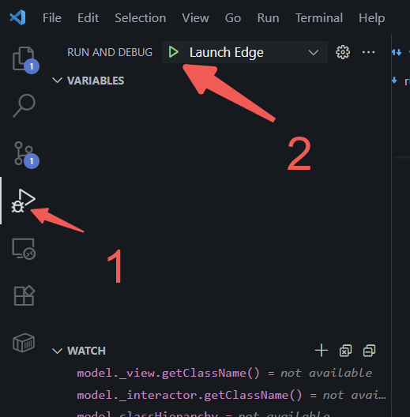

# VTK 例子运行和测试

VTK 的整个框架中有大量的例子可以供学习和实验，如果配合 debug 功能和自定义例子能够很好的理解 VTK 的一些运行机制和架构，方便灵活的使用和调试甚至自定义 VTK 中的功能。下面将详细介绍如何在当前 VTK 框架下实现例子的运行、debug 以及自定义例子。

## 有哪些例子可以运行

访问 vtkjs 的官方例子网站[vtk js example](https://kitware.github.io/vtk-js/examples/)，其中左侧的侧边栏有所有官方提供的可以运行实验的例子。这些例子都可以在本项目中找到并且运行，当然也可以全部打断点单步执行。

## 运行某个例子

首先需要在根目录下面执行`npm install`安装 VTK 的依赖,否则直接执行运行例子的脚本会报错。

VTK 中所有的例子都分布在两个地方

1. Example 文件夹之下
2. Source 文件夹下的某个文件夹下的 example 文件夹下

### Examples 文件夹之下

Examples 文件夹之下的所有含有 index.js 的文件夹都是例子，可以通过 `npm run example example-name` 运行。比如对于`Examples\Rendering\Actor2D\index.js`这个文件中的例子，只要执行`npm run example Actor2D`就可以运行例子，例子运行后，打印如下内容

```powershell
> vtk.js@0.0.0-semantically-release example
> node ./Utilities/ExampleRunner/example-runner-cli.js -c ./Documentation/config.js Actor2D


=> Extract examples

 - GeometryViewer : SKIPPED
 - ImageViewer : SKIPPED
#其余输出
 - Actor2D : Rendering/Actor2D/index.js #当前例子
 - Convolution2DPass : SKIPPED
 - CustomWebGPUCone : SKIPPED
#其余输出
#打包
<s> [webpack.Progress] 99% cache begin idle
<s> [webpack.Progress] 100%
#其余输出
#运行成功
crypto (ignored) 15 bytes [optional] [built] [code generated]
webpack 5.97.1 compiled successfully in 23785 ms
```

然后在本地浏览器中输入`http://localhost:9999/`就可以访问例子做实验了

### Source 文件夹下的某个文件夹下的 example 文件夹下

同上，执行`npm run example example-name`就可以，比如`Sources\Rendering\Core\TextActor\example\index.js`就代表一个例子，只要执行`npm run example TextActor`就可以执行例子，输出和上面的 Examples 下面的例子一致。同样直接运行在本地浏览器中输入`http://localhost:9999/`就可以访问。

## 自定义例子

如果我们想要自己验证某个 VTK 的功能，可以自定义例子，最简单的方式就是在 Examples 文件夹之下的某个文件夹下面新建文件夹，然后在其中添加 index.js 文件。

这样只要运行`npm run example example-name`，其中`example-name`是我们自定义的文件夹的名称，就可以执行这个自定义例子了。

比如我自己定义了`Examples\Geometry\Triangle\index.js`这个文件来渲染一个三角形。
之后我就可以执行`npm run example Triangle`来运行我自定义的例子。

## Debug

运行例子不能很好的让我们理解 VTK 的架构和一些功能实现，如果可以 Debug，打断点之后逐步运行，那将大大的提升对 VTK 架构和运行机制的理解。

### Debug 前的准备

我已经在`.vscode`文件夹下面添加了 `launch.json` 文件，用来 Debug。注意，目前的`launch.json`文件写的是 edge 的配置，默认其动 edge 来调试，如果希望使用 chrome 获取 safari 等其他的浏览器，需要更改`'type'`字段

```json
{
  // Use IntelliSense to learn about possible attributes.
  // Hover to view descriptions of existing attributes.
  // For more information, visit: https://go.microsoft.com/fwlink/?linkid=830387
  "version": "0.2.0",
  "configurations": [
    {
      "name": "Launch Edge",
      "request": "launch",
      "type": "msedge",
      "url": "http://localhost:9999",
      // "webRoot": "${workspaceFolder}/Examples"
      "webRoot": "${workspaceFolder}/Sources"
    }
  ]
}
```

上述`launch.json`中的`webRoot`字段比较关键，表示的是调式器代码映射到哪个文件夹作为根目录来调试代码，如果我们希望调试`Examples`文件夹下的例子，就需要写`"webRoot": "${workspaceFolder}/Examples"`,如果希望调试`Source`下面的例子就需要写`"webRoot": "${workspaceFolder}/Sources"`，如果这个值没有写对，会导致断点无法命中，请一定要注意 ⚠️。

### 执行 Debug

有了上述的`launch.json`后想要 Debug 很简单, 只需要两步就可以。

第一，执行上面提到的`npm run example example-name`，运行想要 debug 的例子

第二，有了`launch.json`之后，我们可以点击 vscode 左边的侧边栏的`小虫子 + 三角形`按钮，然后在切换的 tab 页中点击`launch edge`就会弹出浏览器弹窗并且命中我们的断点了。


