# CPR(Curved Planar Reconstruction)曲面影像重建详解

## 介绍

CPR(Curved Planar Reconstruction)曲面影像重建就是在3D影像中沿着某个固定的路线来切割体数据，然后将这些体数据展开为一个二维纹理展示的技术，如下图所示，将一个沿着牙齿的曲线展开为一个全景面。
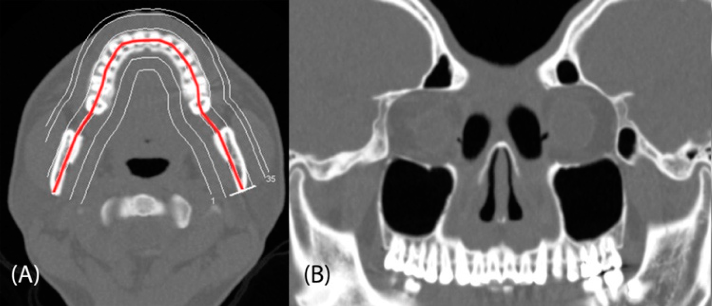

VTK中使用ImageCPRMapper这个类将3D体数据映射为2D纹理，先简单的介绍一下其基本的原理。其实核心就是3个数据集，
- 3D体数据
- 重建的曲线（通过很多点组成）
- 曲线上面每个点在3D体数据的采样方向（其实就是一个旋转矩阵）。

看官方的例子ImageCPRMapper/example下的例子,下面的图就是默认的例子，渲染的是一个人体的躯干的某个切面，其中红色的线为我们沿着3D体数据（这里是人的躯干）采样的线，然后这里每个点的采样方向是绿色的线代表的方向，我们每个采样线上的点都会沿着采样方向在3D纹理中采样，最后得到一个采样完成的纹理，再将这个纹理展示出来，就是中间这个躯干的从切面了。这里绿色的线的方向是一个所以所有的点都是朝着一个方向采样的，但是其实我们可以给每个点都定义不同的方向。

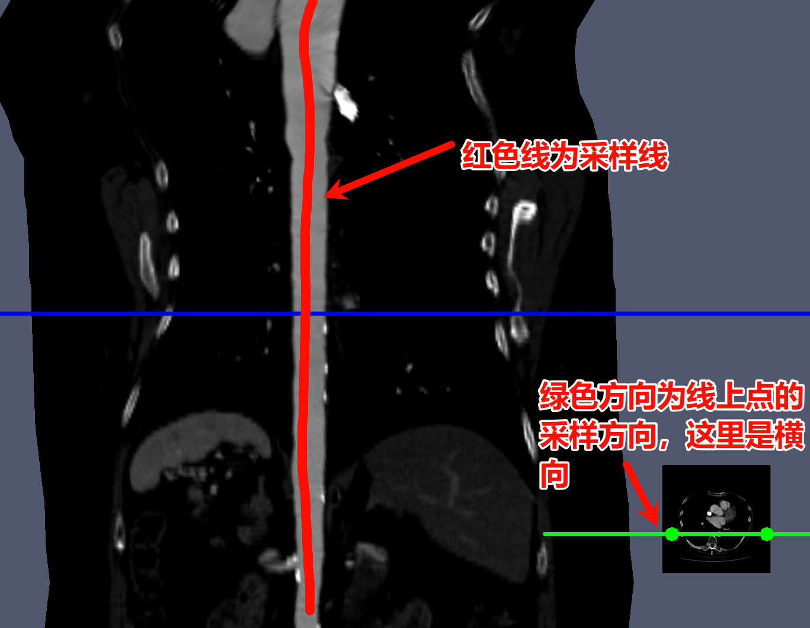

可以通过更改绿色线的位置，将切面旋转，因为采样方向变了。如下图。

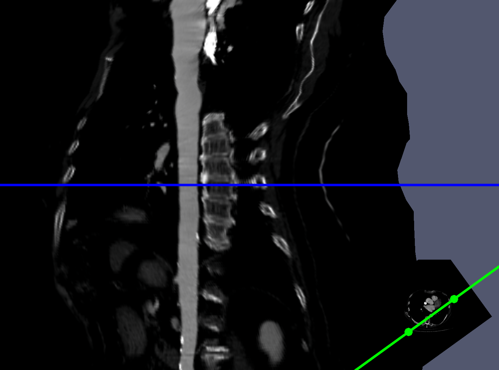

## 过程详解

下面直接介绍整个从采样线和采样方向获取体数据中的纹理的核心原理，vtkjs的整套采样代码也是基于这个原理构建的。

上述三个数据添加之后，将中心线的数据获取，也就是一个包含三维点的列表，为了方便解释和图解，这里假设只有三个点（A,B,C）。vtkjs会先将这些点组合成相邻的两个点的线段(AB, BC),下图展示了他们在世界坐标系中的位置，也就是真实的3D体数据中这三个点的位置，其中所有的单位都是真实的距离。
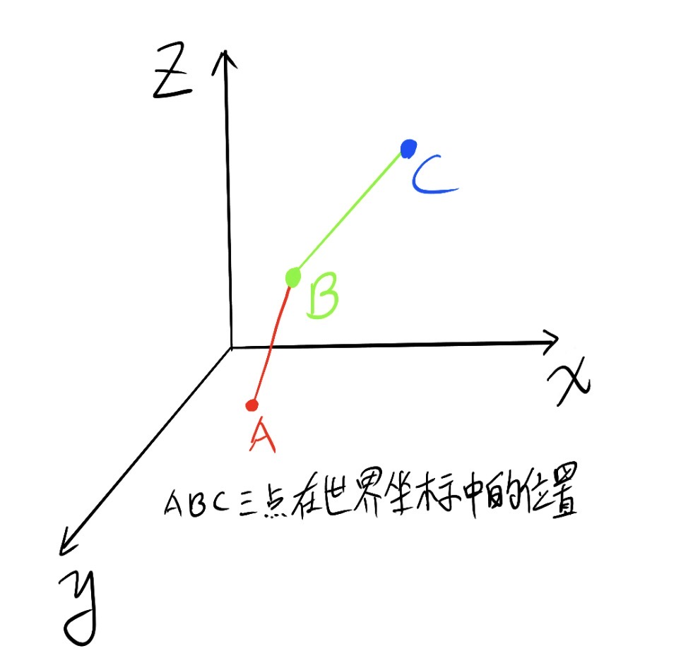

然后vtkjs建立一个二维坐标系，这个二维坐标系中所有的点都会放置在Y坐标轴上，最后一个点在（0,0）位置，第一个点在（0，height）位置，其中height就是所有的点组成的整个线段的长度。这里在这个坐标系上相当于vtkjs将所有的传入点拉伸成了一个沿着Y轴倒序放置的直线。最后一个点C在初始位置，而第一个点A在height位置。

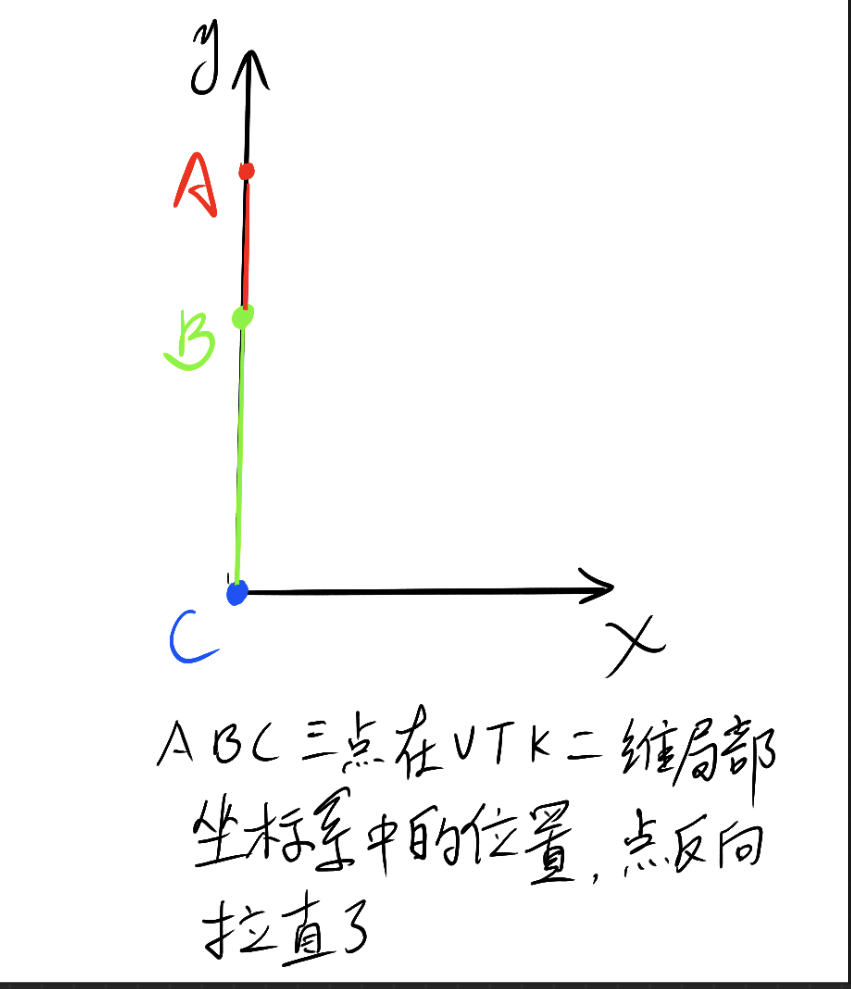

通过这几个点和线段，vtkjs会构建一系列点阵和片元。这些片元会最后成为我们渲染出来的切片。接下来以每个线段迭代一次，构建四个点，CB线段构建了四个点cb1(0,0), cb2(1, 0), cb3(0, length(BC)), cb4(1, length(BC)), BA线段构建四个点ba1(0, length(BC)), ba2(1, length(BC)), ba3(0, height), ba4(1, height)。注意其中有几个点其实是重复的，也就是相同的点，比如cb3和ba1。这里生成的每一个由四个点构成的四边形被vtkjs称为一个quad。其中每个矩形的四个点都会标记编号，cb1为编号1，cb2为编号2，cb3为编号3，cb4为编号4，以此类推。这个编号被存为quadIndex变量。


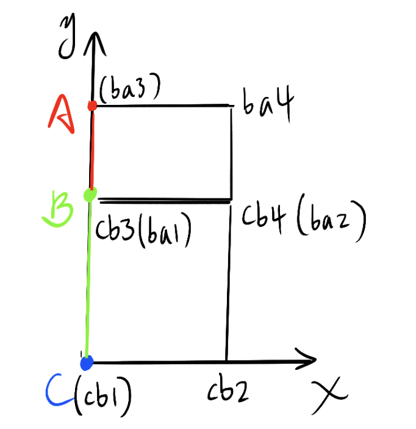

假设我们并没有添加方向矩阵，那么vtkjs默认会将所有的上述矩形的点向x轴负方向移动 0.5xwidth的距离，其中width就是我们定义的矩形切片的宽度，也就是最后看到的切片图像的垂直于采样线方向的高度。这一步完成后，上述的点会变成CB线段构建了四个点cb1(-0.5xwidth,0), cb2(0.5xwidth, 0), cb3(-0.5xwidth, length(BC)), cb4(0.5xwidth, length(BC)), BA线段构建四个点ba1(-0.5xwidth, length(BC)), ba2(0.5xwidth, length(BC)), ba3(-0.5xwidth, height), ba4(0.5xwidth, height)。


假设这个时候我们不考虑任何的方向旋转，那么vtkjs默认的采样方向就是(1,0,0)方向，所以上述的几个点可以用下面的公式来从体数据中采样，这里有两个点需要注意：
- vtk中所有的坐标系都使用世界坐标系，所以我们采样的纹理坐标也会转为世界坐标系
- 我们只关心采样方向，也就是上图中的x方向（vtkjs中也称之为tangent方向），而采样线方向我们从一开始就知道。

```glsl
//centerlinePosVSOutput是我们每个中心线的采样点的世界坐标，其实也就是C，B，A这几个点在世界坐标系中的位置
//horizontalOffset就是上述每个点的x方向的偏移，-0.5xwidth或者0.5xwidth,根据坐标点的quadindex确定符号正负。
vec3 volumePosMC = centerlinePosVSOutput + horizontalOffset;
```
经过上述变化之后volumePosMC就是中心采样线沿着x正方向采样纹理得到的纹理坐标了。因为quad这些点和都会被传入顶点着色器，所以其实每个quad的点之间都会被着色器插值出许许多多的点，这些点都会去插值采样纹理。最后这些片元组合在一起就得到一个x为width宽，y为height长的纹理，也就是整个切片了。

注意，上述做的所有的的操作都是为了映射到正确的纹理采样坐标，而最后纹理会被渲染到一个`(0,0),(width,0),(0,height),(width,height)`的四边形上，
这个四边形就是最后渲染输出的图案。

当然，实际情况是每个上述点都可能有一个定义好的旋转方向，确定每个采样点具体的采样方向。在有旋转的情况下，这是我们也开始通过orientation向量传入进去的（后文会详述）。这样每个点cb1，cb2，cb3, cb4都会有自己的定义好的旋转矩阵，而通过着色器插值的他们之间的每一个点的旋转矩阵则被vtkjs用球面线性插值的方式计算得出。
```glsl
// 球面插值 (SLERP),假设q0是cb1的旋转矩阵，q1是cb3的旋转矩阵
//quadOffsetVSOutput.y是插值点在cb1和cb3之前的相对距离的比例，取0~1的值
//omega是两个旋转矩阵之间的夹角
  interpolatedOrientation = normalize(
    sin((1.0 - quadOffsetVSOutput.y) * omega) * q0 +
    sin(quadOffsetVSOutput.y * omega) * q1
  );
```
这样最后的采样函数会加上旋转的的影响
```glsl
  // 4. 采样方向计算
  samplingDirection = applyQuaternionToVec(interpolatedOrientation, tangentDirection)

  // 5. 最终3D位置
  volumePosMC = centerlinePosVSOutput + horizontalOffset * samplingDirection
```

上述解释只是对于vtkjs整个CPR采样过程的直观描述，具体的实现过程比较复杂，需要结合源代码和例子详细分析才能够有最清晰的理解。感兴趣的可以自己运行ImageCPRMapper的官方例子详细查看每一个步骤的细节。

## 代码详解：获取牙齿的曲面投影

用实际例子来将上述概论的采样方式应用到代码中完成一个牙齿曲面的构建。

```javascript
// 1. 创建基础渲染对象
      const grw = vtkGenericRenderWindow.newInstance()
      const renderer = grw.getRenderer()
      const renderWindow = grw.getRenderWindow()
      const GLWindow = grw.getApiSpecificRenderWindow()

      // 2. 配置渲染器
      renderer.getActiveCamera().setParallelProjection(true)
      renderer.setBackground(0.2, 0, 0)

      // 3. 建立VTK对象之间的连接
      renderWindow.addRenderer(renderer)
      renderWindow.addView(GLWindow)

      // 4. 设置容器
      GLWindow.setContainer(containerRef.current)

      //构建中心线实例
      const centerLine = vtkPolyData.newInstance()

      const actor = vtkImageSlice.newInstance()
      renderer.addActor(actor)

      //这里非常关键，用的是ImageCPRMapper
      const mapper = vtkImageCPRMapper.newInstance()
      actor.setMapper(mapper as any)

    //需要输出两个inputData，一个是需要采样的3D数据，一个是中心线
      mapper.setInputData(imageData, 0)
      mapper.setInputData(centerLine, 1)
      mapper.setWidth(640 * 0.25)//设置切片的宽度

      //可以设置将中心点拉到同一直线上还是保留中心点的沿着tangent方向的方向偏移
      // mapper.useStretchedMode()
      mapper.useStraightenedMode()

      //可以设置采样的深度，也就是切片的厚度
      // mapper.setProjectionSlabThickness(10)
      // mapper.setProjectionSlabNumberOfSamples(10)
      //mapper.setProjectionMode(ProjectionMode.AVERAGE)

      grw.setContainer(containerRef.current)
      grw.resize()
```
将下面的图中示例的绿色的点组成的中心线作为我们的采样中心线传入，中心线中每个点的坐标都是世界坐标。
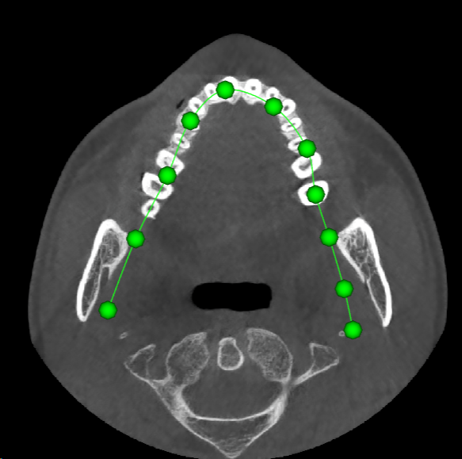
```javascript
//centerLinePoints就是上图中绿色的点，将其放置到centerline对象中
const nPoints = centerLinePoints.length / 3
centerLine.getPoints().setData(centerLinePoints, 3)

//设置这些点渲染时候的按照index绘制成线
const centerlineLines = new Uint16Array(1 + nPoints)
centerlineLines[0] = nPoints
for (let i = 0; i < nPoints; ++i) {
centerlineLines[i + 1] = i
centerLine.getLines().setData(centerlineLines)
```

有了中心线之后还需要计算中心线上每个点的的orientation，采样的方向坐标矩阵是根据下面的规则定义的
```javascript
//方向矩阵
tangent[0], bitangent[0], normal[0], point[x]
tangent[1], bitangent[1], normal[1], point[y]
tangent[2], bitangent[2], normal[2], point[z]
0,          0,            0,         1
```
tangent方向为采样方向，也就是上述局部x，y坐标系统中的x方向，bitangent方向为中心线的点的方向的反向，也就是上述局部x,y坐标系中的y方向，normal方向是垂直于tanget，bitangent，为tangent x bitangent的方向。point为点的实际世界坐标系中的坐标（其实好像没有用到）。

因为想要的是牙齿的切面，三个方向分别如下。其中tangent为垂直于屏幕，指向屏幕外侧。
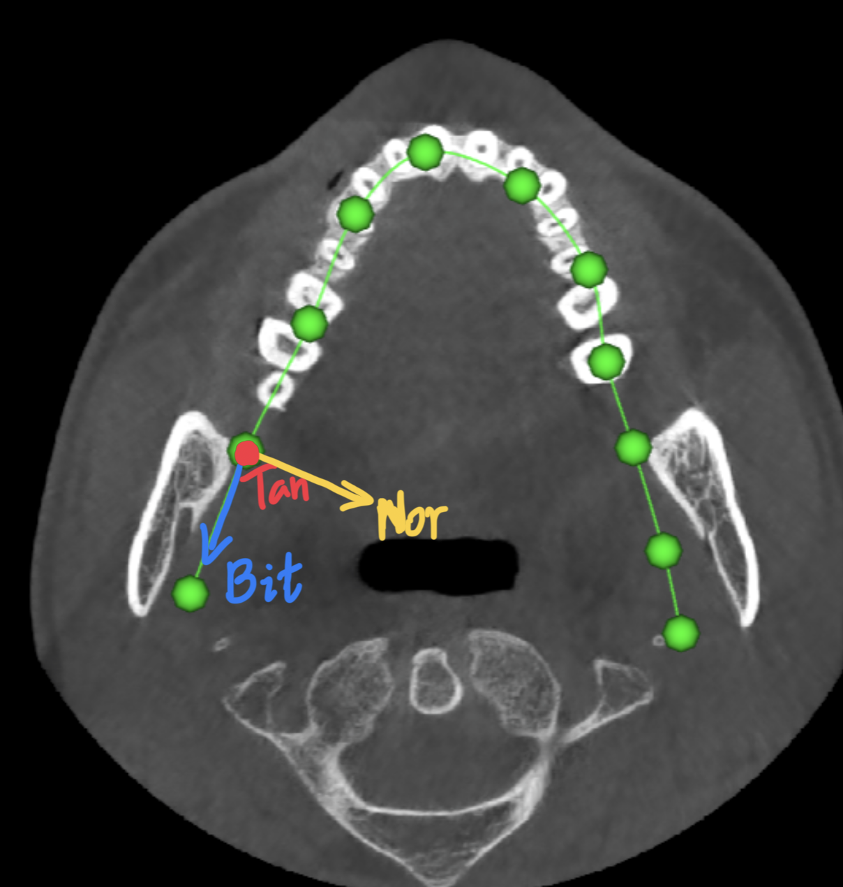

当前的图像处在世界坐标系中，世界坐标系的三个方向如下,其中Z轴为垂直于屏幕向外的方向。
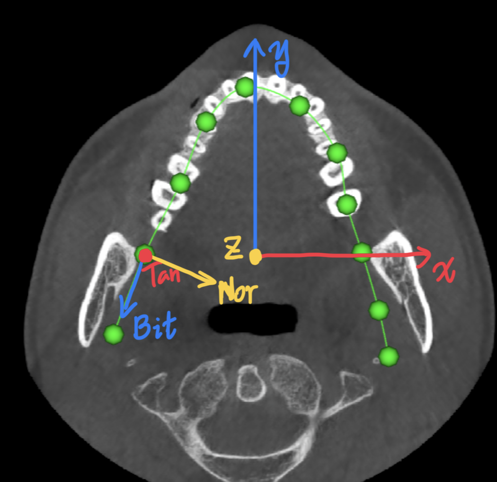

所以构建一个函数计算每个点的三个方向,其中tangent始终是(0,0,1)，bitangent为两个绿点差值的归一化的，normal为tangent和bitangent叉乘后归一化。上述的每两个点计算的矩阵列表，作为函数`calculateOrientationsWithReference`的返回值。

```javascript
const orientations = calculateOrientationsWithReference(centerLinePoints)

//为centerLine设置orientations
centerLine.getPointData().setTensors(
vtkDataArray.newInstance({
    name: 'Orientation',
    numberOfComponents: 16,
    values: orientations,
})
)
centerLine.modified()
```
有了上述代码之后其实我们渲染就可以得到一个结果了，但是因为渲染出来的切片矩形是在`(0,0),(width,0),(0,height),(width,height)`的四边形上的，所以展示的位置不是我们想要的位置，而且前文提过，最后的矩形的x方向是tangent方向，y方向是点的的顺序的逆方向，上述绿点的在传入centerline时候是按照先传入左边的点，再传入右边的点的方式的，所以这些点最后得到的四边形和原图之间的关系如下。
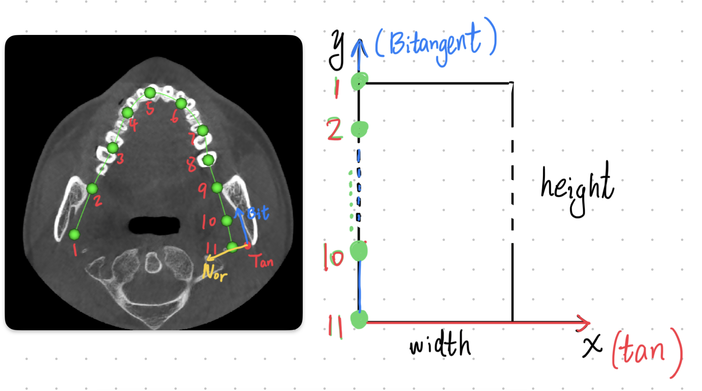

所以为了将最后渲染得到的图形正确的方向展示出来，我们需要调节相机到上述图片中正确的方向。
```javascript
const width = mapper.getWidth()
const height = mapper.getHeight()

//中心点
const cameraFocalPoint = [0.5 * width, 0.5 * height, 0] as vec3

//希望在z方向反方向看这个切片
const cameraDirection = [0, 0, -1] as vec3

// CPR camera reset，距离focalpoint的距离
const stretchCamera = renderer.getActiveCamera()
const cameraDistance =
    (0.5 * height) /
    Math.tan(radiansFromDegrees(0.5 * stretchCamera.getViewAngle()))
//设置相机的拍摄范围高度
stretchCamera.setParallelScale(0.5 * width)
stretchCamera.setParallelProjection(true)

//相机位置
const cameraPosition = vec3.scaleAndAdd(
    [] as unknown as vec3,
    cameraFocalPoint,
    cameraDirection,
    cameraDistance
)
stretchCamera.setPosition(
    cameraPosition[0],
    cameraPosition[1],
    cameraPosition[2]
)
stretchCamera.setFocalPoint(
    cameraFocalPoint[0],
    cameraFocalPoint[1],
    cameraFocalPoint[2]
)

//相机上方向
stretchCamera.setViewUp(-1, 0, 0)
renderer.resetCameraClippingRange()

renderWindow().render()
```
最后渲染得到下图.
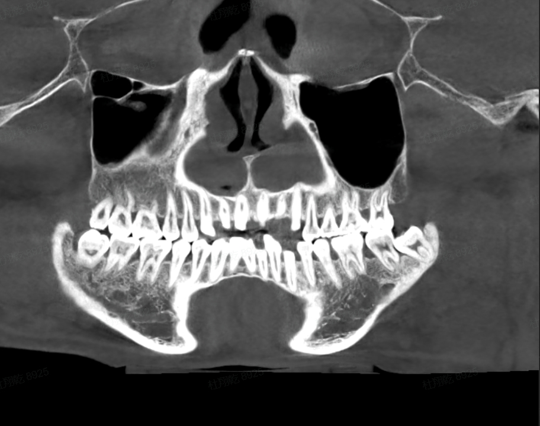
