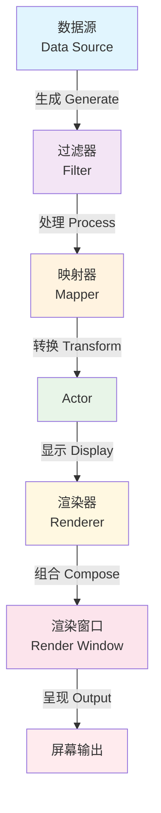

# VTK架构概述

## 概述

vtk.js 是 C++版本的 VTK 的 JavaScript 实现,用于基于 Web 的 3D 图形、体绘制和科学可视化。它是用 ES6 JavaScript 完全重写的 VTK(而非移植),专注于使用 WebGL/WebGPU 渲染几何数据(PolyData)和体数据(ImageData)。

## 框架结构

vtkjs 的核心框架结构有两个
- 基于管道的渲染数据流动和渲染架构
- 基于场景图的逐层渲染管理机制

### 数据流架构
vtk.js 遵循模块化、基于管道的架构,数据通过一系列处理阶段流动:



#### 实例说明:三角形渲染

以下通过一个简单的三角形渲染示例,说明数据如何在 VTK 管道中流动:

##### 1. 数据源 (Data Source) - vtkPolyData

```javascript
// 创建三角形的顶点数据
const points = new Float32Array([
  0.0, 1.0, 0.0,    // 顶点0: 顶部
  -1.0, -1.0, 0.0,  // 顶点1: 左下
  1.0, -1.0, 0.0,   // 顶点2: 右下
]);

// 定义三角形的连接关系
const triangles = new Uint32Array([
  3,        // 这个多边形有3个点
  0, 1, 2   // 使用顶点0、1、2
]);

// 创建 PolyData 并设置几何数据
const trianglePolyData = vtkPolyData.newInstance();
trianglePolyData.getPoints().setData(points, 3);
trianglePolyData.getPolys().setData(triangles, 1);
```

**说明**: `vtkPolyData` 是数据源,存储原始的几何信息(顶点坐标、多边形连接)。此阶段纯粹是数据定义,不涉及任何渲染或转换。数据源可以是自己定义的几何数据，可以是模体数据，也可以是dicom中读取的体数据。

##### 2. 过滤器 (Filter) - 可选

在这个简单示例中,我们直接使用原始数据,没有经过过滤器处理。在复杂场景中,过滤器可以:
- 平滑表面 (vtkWindowedSincPolyDataFilter)
- 细分网格 (vtkButterflySubdivisionFilter)
- 提取等值面 (vtkContourFilter)

Filter就是对原始数据做处理，举个最简单的例子，对原始数据进行差值就是一个Filter做的事情。

##### 3. 映射器 (Mapper) - vtkMapper

```javascript
const mapper = vtkMapper.newInstance();
mapper.setInputData(trianglePolyData);
```

**说明**: Mapper 是管道中的关键转换器,它:
- 接收几何数据 (PolyData)
- 将数据转换为 GPU 可理解的格式(顶点缓冲、索引缓冲)
- 准备 WebGL 着色器所需的数据结构

Mapper将上一级的数据转换为GPU可以理解的数据，正如我们在OpenGL中经常使用的顶点缓冲，索引缓冲等，只有这个转换了，GPU才可以渲染原始数据。

##### 4. Actor - 可视化属性

```javascript
const actor = vtkActor.newInstance();
actor.setMapper(mapper);
actor.getProperty().setColor(1.0, 0.2, 0.2); // 设置红色
```

**说明**: Actor 将数据(通过 Mapper)与可视化属性结合:
- 颜色、透明度
- 变换矩阵(位置、旋转、缩放)
- 渲染模式(实体、线框、点)

Actor相当于给Mapper传递过来的顶点数据添加渲染时候需要的属性，Actor对应的是一个最后能够被渲染出来的实体，比如一个三角形可以是一个Actor，他在vtk定义的渲染空间（用世界坐标系表示）中被渲染，如果我们需要两个三角形，最好是定义为两个Actor。

Actor这个名字顾名思义，就是演员，也就是被渲染的实体，它只用来代表渲染实体和其相关的属性，比如颜色，渲染模式（实体，线框），透明度等。但是不包括灯光，摄像机等场景基本的设置。

##### 5. 渲染器 (Renderer) - 场景管理

```javascript
const renderer = vtkRenderer.newInstance({ background: [0.2, 0.3, 0.4] });
renderer.addActor(actor);
renderer.resetCamera(); // 调整相机使物体可见
```

**说明**: Renderer 管理整个3D场景:
- 包含多个 Actor(本例只有一个三角形)
- 管理相机、灯光
- 设置背景颜色
- 执行视锥体裁剪

Renderer管理整个场景，场景中可以包括多个Actor，每个Actor可以单独设置属性，然后Renderer会管理场景中的其他设置项，比如灯光，相机等。

##### 6. 渲染窗口 (Render Window) - 输出管理

```javascript
const renderWindow = vtkRenderWindow.newInstance();
renderWindow.addRenderer(renderer);

// 创建 OpenGL 渲染窗口
const openglRenderWindow = vtkOpenGLRenderWindow.newInstance();
renderWindow.addView(openglRenderWindow);

// 绑定到 DOM 容器
openglRenderWindow.setContainer(container);
openglRenderWindow.setSize(window.innerWidth, window.innerHeight);

// 执行渲染
renderWindow.render();
```

**说明**: RenderWindow 负责最终输出:
- 管理 WebGL 上下文
- 协调多个 Renderer(可以分屏显示)
- 处理窗口大小变化
- 触发实际的 GPU 绘制调用

RenderWindow 是渲染窗口,管理最终渲染结果的显示。如果包含多个 Renderer(多个场景),可以将这些场景渲染到同一个 RenderWindow 的不同区域。具体实现是:在每个 Renderer 上调用 setViewport(xmin, ymin, xmax, ymax) 设置归一化坐标(0-1范围),OpenGL Renderer 在渲染时会将其转换为像素坐标,然后调用 gl.viewport() 和 gl.scissor() 限制该 Renderer 的绘制区域,实现分屏效果。

例子
```typescript
// 示例:三分屏显示
// 上半部分 - 渲染圆锥
const upperRenderer = vtkRenderer.newInstance();
upperRenderer.setViewport(0, 0.5, 1, 1); // 占据上半部分
renderWindow.addRenderer(upperRenderer);

// 左下四分之一 - 渲染球体
const lowerLeftRenderer = vtkRenderer.newInstance();
lowerLeftRenderer.setViewport(0, 0, 0.5, 0.5); // 占据左下四分之一
renderWindow.addRenderer(lowerLeftRenderer);

// 右下四分之一 - 渲染立方体
const lowerRightRenderer = vtkRenderer.newInstance();
lowerRightRenderer.setViewport(0.5, 0, 1, 0.5); // 占据右下四分之一
renderWindow.addRenderer(lowerRightRenderer);

renderWindow.render();
```

##### 数据流总结

```
原始数据(顶点数组)
    ↓
vtkPolyData.setData() ← 【数据源】存储几何信息
    ↓
mapper.setInputData() ← 【映射器】转换为 GPU 格式
    ↓
actor.setMapper() ← 【Actor】附加可视化属性(颜色、变换)
    ↓
renderer.addActor() ← 【渲染器】场景组合、相机裁剪
    ↓
renderWindow.addRenderer() ← 【渲染窗口】WebGL 上下文管理
    ↓
renderWindow.render() ← 【执行】GPU 绘制到屏幕
```

**关键点**:
- **单向数据流**: 数据从源头流向显示,每个阶段只负责特定职责
- **延迟执行**: 只有调用 `renderWindow.render()` 时才真正执行 GPU 绘制
- **管道更新**: 修改数据源后需要调用 `modified()` 和 `render()` 来更新显示
- **可复用性**: 一个 Mapper 可被多个 Actor 使用(不同位置显示同一模型)

#### 提问
- 如果我希望更改一个渲染的三角形的颜色，我应该在渲染管线中的那个节点（比如renderer， actor， mapper等）去更改？如果我要更改摄像机的位置和灯光颜色呢？
- 如果我希望在一个窗口里面同时看到一个三角形的正视图和背视图, 每个占据1/2大小，我该如何做？

### 场景图架构

vtk.js 的场景图架构是整个渲染系统的核心，它提供了一个统一的、层次化的方式来管理和渲染3D场景中的所有对象。不同于传统图形库的场景图概念，vtk.js 的场景图更专注于科学可视化的需求，同时支持多种渲染后端（OpenGL/WebGPU）的抽象。

#### 什么是场景图

场景图是一个层次化的数据结构，用于组织和管理3D场景中的对象。在 vtk.js 中，场景图不仅负责空间层次的管理，更重要的是实现了**抽象渲染对象**与**具体实现对象**之间的映射关系。

```
抽象层场景图              具体实现场景图
(用户操作的对象)           (实际渲染的对象)
     │                        │
  vtkRenderer  ←──映射───→  vtkOpenGLRenderer
     │                        │
  vtkActor     ←──映射───→  vtkOpenGLActor
     │                        │
  vtkMapper    ←──映射───→  vtkOpenGLPolyDataMapper
```

#### 场景图的特点

1. **双重结构**：维护抽象对象树和实现对象树
2. **动态映射**：运行时建立抽象与实现的对应关系
3. **渲染导向**：专为渲染管线优化的遍历机制
4. **平台无关**：统一的接口支持多种渲染后端

#### 核心架构ViewNode系统

`vtkViewNode` 是场景图中所有节点的基类，定义了场景图的基本行为。上述提到的渲染管线中设计到的所有的类型，比如`RenderWindow`, `Renderer`, `Camera`, `Actor`, `Mapper`等都是一个渲染节点`vtkViewNode`。vtkjs将这些节点组织为一个节点树，然后从根节点开始遍历节点完成渲染。

```
//  节点树的层次结构
RenderWindow (ViewNode)
├── Renderer (ViewNode)
│   ├── Camera (ViewNode)
│   ├── Light (ViewNode)
│   ├── Actor (ViewNode)
│   │   └── Mapper (ViewNode)
│   │       └── DataSet (ViewNode)
│   ├── Volume (ViewNode)
│   │   └── VolumeMapper (ViewNode)
│   └── Actor2D (ViewNode)
└── RenderPass (ViewNode)
```

#### 场景图架构的设计目的

vtk.js 采用场景图架构的核心目的是解决科学可视化中的以下关键问题:

##### 1. **抽象与实现分离 (Abstract-Implementation Separation)**

**问题**: 用户希望编写一次代码,能够在不同的渲染后端(WebGL、WebGPU)上运行,而不需要关心底层实现细节。

**解决方案**:
- **用户操作层**: 用户只与抽象类交互,如 `vtkRenderer`, `vtkActor`, `vtkMapper`
- **后端实现层**: 由 `ViewNodeFactory` 自动创建对应的实现对象,如 `vtkOpenGLRenderer`, `vtkWebGPURenderer`
- **透明切换**: 切换渲染后端只需更改 Factory,用户代码无需修改

```javascript
// 用户代码保持不变
const renderer = vtkRenderer.newInstance();
const actor = vtkActor.newInstance();
renderer.addActor(actor);

// ViewNodeFactory 根据当前后端自动创建:
// - OpenGL 后端: vtkOpenGLRenderer + vtkOpenGLActor
// - WebGPU 后端: vtkWebGPURenderer + vtkWebGPUActor
```

##### 2. **统一的渲染遍历机制 (Unified Rendering Traversal)**

**问题**: 不同类型的对象(几何体、体积、2D标注)需要在不同的渲染阶段以不同的方式处理,如何统一管理?

**解决方案**: 使用 `RenderPass` 系统 + `traverse()` 递归遍历

```javascript
// 渲染流程
ForwardPass.traverse(rootViewNode)
  ├─ buildPass: 构建场景图
  │   └─ 为新增对象创建 ViewNode
  ├─ opaquePass: 渲染不透明物体
  │   └─ 深度测试开启,按深度排序
  ├─ translucentPass: 渲染半透明物体
  │   └─ 使用 Order Independent Translucency
  └─ volumePass: 渲染体积数据
      └─ Ray casting 算法
```

每个 ViewNode 都有统一的 `traverse(renderPass)` 接口,可以根据当前 Pass 类型执行不同操作:

```javascript
// ViewNode 的遍历逻辑
publicAPI.traverse = (renderPass) => {
  const operation = renderPass.getOperation(); // 获取当前操作: 'build', 'opaquePass', 等
  publicAPI.apply(renderPass, true);  // 前序处理

  // 递归遍历子节点
  for (let child of model.children) {
    child.traverse(renderPass);
  }

  publicAPI.apply(renderPass, false); // 后序处理
};
```

##### 3. **动态场景图同步 (Dynamic Scene Graph Sync)**

**问题**: 用户随时可能添加/删除对象,如何高效地同步抽象对象树和实现对象树?

**解决方案**: 三阶段同步机制

```
buildPass 阶段:
1. prepareNodes()       → 标记所有节点为"未访问"
2. addMissingNodes()    → 为新增的抽象对象创建对应的 ViewNode
3. removeUnusedNodes()  → 删除标记为"未访问"的 ViewNode (已被移除的对象)
```

**示例**:
```javascript
// 用户添加新 Actor
const newActor = vtkActor.newInstance();
renderer.addActor(newActor);

// 下次 render() 时:
// buildPass 会检测到 newActor 没有对应的 ViewNode
// → 调用 ViewNodeFactory.createNode(newActor)
// → 创建 vtkOpenGLActor ViewNode
// → 建立映射关系: newActor ↔ vtkOpenGLActor ViewNode
```

##### 4. **分阶段渲染控制 (Multi-Pass Rendering Control)**

**问题**: 复杂场景需要多次渲染(不透明物体先渲染、半透明物体后渲染、体积渲染需要特殊处理),如何组织?

**解决方案**: RenderPass 定义渲染操作序列

```javascript
// ForwardPass 的渲染顺序
model.preDelegateOperations = [
  'buildPass',           // 构建/更新场景图
  'cameraPass',          // 更新相机矩阵
];

// 根据场景内容动态决定
if (hasOpaqueActors) {
  render('opaquePass');  // 渲染不透明物体
}

if (hasTranslucentActors) {
  translucentPass.traverse();  // 使用专门的半透明 Pass
}

if (hasVolumes) {
  render('volumePass');  // 体积渲染
}
```

#### 场景图架构的关键好处

##### 1. ✅ **跨平台渲染后端支持**

- 用户代码与渲染后端解耦
- 添加新后端只需实现新的 ViewNode 和 ViewNodeFactory
- 目前支持: OpenGL (WebGL 1.0/2.0) 和 WebGPU

**实际效果**:
```javascript
// 同一份代码,不同后端
// OpenGL 后端
import 'vtk.js/Sources/Rendering/Profiles/Geometry'; // 自动注册 OpenGL 实现

// WebGPU 后端 (未来)
import 'vtk.js/Sources/Rendering/Profiles/GeometryWebGPU'; // 切换到 WebGPU 实现
```

##### 2. ✅ **高效的增量更新**

- **只更新变化的部分**: 通过 `visited` 标记避免重复处理
- **自动资源管理**: 删除的对象会自动释放 GPU 资源
- **智能重建**: 只在需要时重新构建场景图

**性能优势**:
```javascript
// 每帧只处理实际变化的对象
renderWindow.render();
// → buildPass 检测到 Actor A 被修改
// → 只重建 Actor A 的 ViewNode
// → 其他未变化的 ViewNode 直接复用
```

##### 3. ✅ **灵活的渲染管线**

- **可插拔的 Pass**: 可以自定义 RenderPass 插入特殊效果
- **多阶段渲染**: 支持 Shadow Mapping、SSAO、Bloom 等多 Pass 技术
- **节点级控制**: 每个节点可以重写 `traverse` 方法自定义行为

**扩展示例**:
```javascript
// 自定义 Pass: 边缘检测
class EdgeDetectionPass extends vtkRenderPass {
  traverse(viewNode, parent) {
    // 1. 渲染到离屏纹理
    // 2. 应用边缘检测 Shader
    // 3. 合成到最终画面
  }
}

// 插入到渲染管线
forwardPass.setPostDelegateOperations(['edgeDetectionPass']);
```

##### 4. ✅ **统一的资源管理**

- **生命周期管理**: ViewNode 管理 GPU 资源(纹理、缓冲区、Shader)的创建和释放
- **资源复用**: 多个对象可以共享相同的 GPU 资源
- **内存控制**: 统一的 `releaseGraphicsResources()` 接口

**资源管理流程**:
```
创建 ViewNode
    ↓
buildPass 中分配 GPU 资源
    ↓
renderPass 中使用资源
    ↓
节点被删除时自动释放资源
```

##### 5. ✅ **良好的扩展性**

- **注册机制**: 通过 `registerOverride()` 注册自定义 ViewNode
- **继承体系**: 自定义节点继承 `vtkViewNode` 即可融入场景图
- **Hook 点**: 多个可重写的方法提供定制能力

**扩展示例**:
```javascript
// 自定义 Actor ViewNode
function vtkCustomActorViewNode(publicAPI, model) {
  vtkOpenGLActor.extend(publicAPI, model);

  // 重写渲染方法
  publicAPI.opaquePass = (prepass) => {
    if (prepass) {
      // 渲染前的自定义逻辑
    }
  };
}

// 注册到 Factory
registerOverride('vtkCustomActor', vtkCustomActorViewNode.newInstance);
```

#### 完整渲染流程示意图

```
用户代码创建抽象对象树
  renderer.addActor(actor)
    ↓
renderWindow.render() 被调用
    ↓
traverseAllPasses() 开始遍历
    ↓
╔═══════════════════════════════════════════════════════════╗
║  ForwardPass.traverse(rootViewNode)                       ║
╠═══════════════════════════════════════════════════════════╣
║  [Phase 1: buildPass]                                     ║
║    ├─ prepareNodes()        → 标记所有节点未访问          ║
║    ├─ addMissingNodes()     → 为新对象创建 ViewNode       ║
║    └─ removeUnusedNodes()   → 清理不再使用的 ViewNode     ║
║                                                           ║
║  [Phase 2: opaquePass]                                    ║
║    ├─ 遍历所有 Actor ViewNode                             ║
║    ├─ 设置 gl.viewport, gl.depthTest                      ║
║    ├─ 绑定 Shader, 上传 Uniform                           ║
║    └─ gl.drawElements() 绘制不透明物体                     ║
║                                                           ║
║  [Phase 3: translucentPass]                               ║
║    ├─ OIT 算法初始化                                      ║
║    ├─ 渲染半透明物体到多个纹理                             ║
║    └─ 合成最终颜色                                        ║
║                                                           ║
║  [Phase 4: volumePass]                                    ║
║    └─ Ray Casting 体积渲染                                ║
╚═══════════════════════════════════════════════════════════╝
    ↓
渲染完成,画面输出到屏幕
```

#### 对比:没有场景图的方案

如果 vtk.js 不使用场景图架构,会面临以下问题:

| 问题 | 无场景图方案 | 场景图方案 |
|------|-------------|-----------|
| **后端切换** | 用户需重写所有 WebGL/WebGPU 代码 | 透明切换,用户代码不变 |
| **对象管理** | 手动维护对象列表,手动创建/销毁 | 自动同步,自动资源管理 |
| **渲染顺序** | 手动排序不透明/半透明对象 | Pass 系统自动处理 |
| **扩展性** | 修改核心渲染代码 | 注册自定义 ViewNode 即可 |
| **性能优化** | 手动检测变化,手动优化 | 增量更新,自动优化 |

#### 小结

vtk.js 的场景图架构是一个精心设计的系统,它:
- **解耦了抽象与实现**,让用户代码更简洁、更可维护
- **统一了渲染流程**,让复杂的多 Pass 渲染变得可管理
- **自动化了资源管理**,减少内存泄漏和 GPU 资源浪费
- **提供了强大的扩展能力**,让高级用户可以定制渲染行为

这种架构看似复杂,但它是为了解决大规模科学可视化中的实际问题而设计的,是 vtk.js 能够同时支持多种渲染后端、处理复杂场景的关键基础设施。


