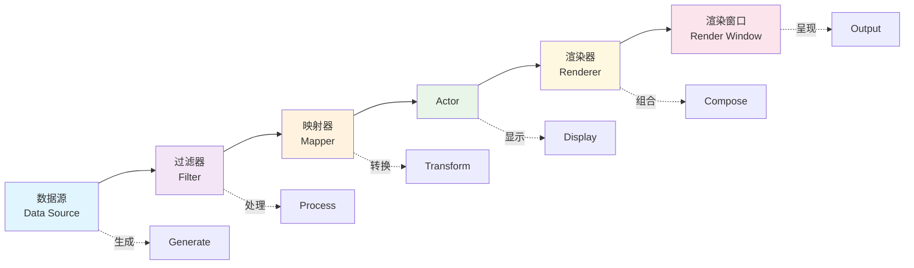

# VTK架构概述

## 概述

vtk.js 是 C++版本的 VTK 的 JavaScript 实现,用于基于 Web 的 3D 图形、体绘制和科学可视化。它是用 ES6 JavaScript 完全重写的 VTK(而非移植),专注于使用 WebGL/WebGPU 渲染几何数据(PolyData)和体数据(ImageData)。

## 框架结构

vtkjs 的核心框架结构有两个
- 基于管道的渲染数据流动和渲染架构
- 基于场景图的逐层渲染管理机制

### 数据流架构
vtk.js 遵循模块化、基于管道的架构,数据通过一系列处理阶段流动:

