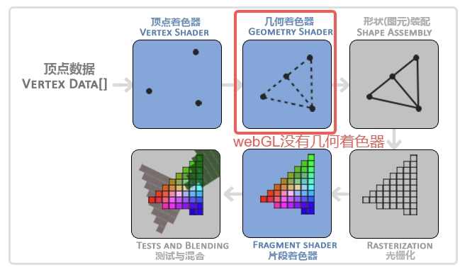
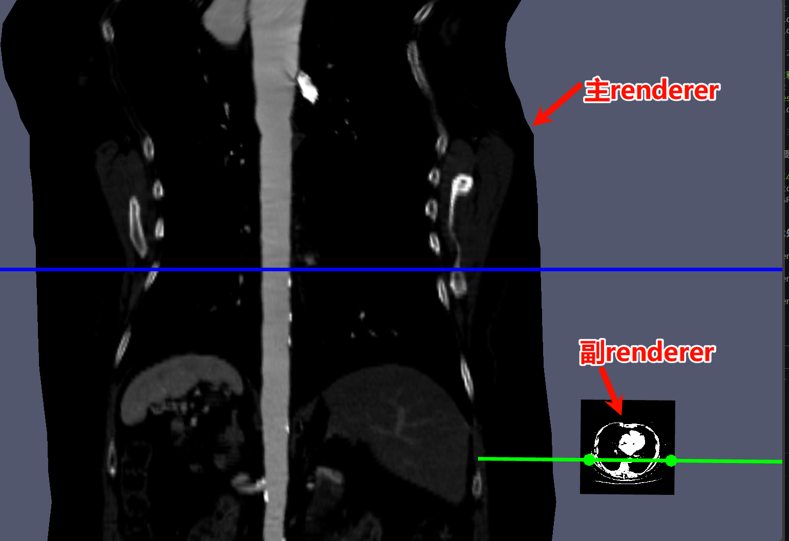

# VTK 渲染管线和渲染流程架构设计

## 渲染过程概述



OpenGL 中的整个渲染过程大概如上图所示。但是 WebGL 中则没有集合着色器。

- 顶点着色器(Vertex Shader)，它把一个单独的顶点作为输入。把 3D 坐标转为另一种 3D 坐标，其实就是顶点在空间中的位移，缩放，旋转等变换，同时顶点着色器允许我们对顶点属性进行一些基本处理。

- 顶点着色器阶段的输出可以选择性地传递给几何着色器(Geometry Shader)。几何着色器将一组顶点作为输入，这些顶点形成图元，并且能够通过发出新的顶点来形成新的(或其他)图元来生成其他形状。

- 图元装配(Primitive Assembly)阶段将顶点着色器（或几何着色器）输出的所有顶点作为输入，并将所有的点装配成指定图元的形状；比如三角形、线段、点等。

- 光栅化阶段(Rasterization Stage)，这里它会把图元映射为最终屏幕上相应的像素，生成供片段着色器(Fragment Shader)使用的片段(Fragment)。在片段着色器运行之前会执行裁切(Clipping)。裁切会丢弃超出你的视图以外的所有像素，用来提升执行效率。OpenGL 中的一个片段是 OpenGL 渲染一个像素所需的所有数据。

- 片段着色器的主要目的是计算一个像素的最终颜色，这也是所有 OpenGL 高级效果产生的地方。通常，片段着色器包含 3D 场景的数据（比如光照、阴影、光的颜色等等），这些数据可以被用来计算最终像素的颜色。

- 在所有对应颜色值确定以后，最终的对象将会被传到最后一个阶段，我们叫做 Alpha 测试和混合(Blending)阶段。这个阶段检测片段的对应的深度和模板值，用它们来判断这个像素是其它物体的前面还是后面，决定是否应该丢弃。这个阶段也会检查 alpha 值，也就是透明图，并用这个值对物体进行混合(Blend)。

## 渲染的基本流程

假设我们只有一个 3x3 像素的屏幕，想要在里面渲染一个三角形。渲染的过程中有以下这些信息需要提前知道。

### 顶点处理

在这个阶段，我们定义三角形的三个顶点坐标，并将它们传递给顶点着色器。假设我们定义三角形的顶点坐标为

## VTKJS 的渲染架构

从上面的渲染过程可以看出，OpenGL/webGL 的渲染过程其实包含了很多细节和各种各样的复杂概念，比如顶点缓冲对象，着色器，纹理，光照，混合，深度测试，模版测试，相机，视口，光源等。并且在使用这麽多概念的同时还需要管理渲染过程中的各种状态，对于一个复杂的可视化场景来说，这些细节和状态的管理会变得非常复杂。也大大增加了新手上手的门槛。vtkjs 的渲染架构就是为了屏蔽这些复杂的细节和状态管理，让用户可以专注于可视化本身，而不是渲染的细节。VTKjs 的渲染场景图核心就是三点

- 渲染职责分离
- 单向数据流
- 构建场景图

### 渲染职责分离

将一个渲染过程想象为拍摄一个电影，那么我们需要哪些部分呢？

- 舞台或者场景，这个是我们拍摄电影的地方。
- 演员或者道具，这些是我们拍摄电影的主体。
- 摄像机，这个是我们拍摄电影的工具，也决定了最终的画面是从哪个方向拍摄的。
- 光源，演员或者道具需要打光来烘托氛围，展示细节。
- 服装，演员可能需要不同的服化道。
- 拍摄镜头，同一个舞台可以有多个摄像机从不同的角度拍摄。

vtkjs 就是基于上述思想创建多个不同的类，每个类负责管理渲染过程中的某一部分职责。保证类的职责单一，易于维护和扩展。

#### 数据源类型 vtkPolyData, vtkImageData 等

**说明**: `vtkPolyData`，可以理解为演员的身高，体型。 存储原始的几何信息(顶点坐标、多边形连接)。此阶段纯粹是数据定义,不涉及任何渲染或转换。数据源可以是自己定义的几何数据，可以是模体数据，也可以是 dicom 中读取的体数据(`vtkImageData`)。数据源包含下面这些信息：

- 顶点坐标 (Points)：每个顶点在三维空间中的位置。
- 拓扑结构 (Polys, Lines, Strips)：定义顶点最后如何绘制，是三角形呢还是线段还是点。
- 点数据 (Point Data)：与每个顶点相关联的属性数据,如颜色、法线、纹理坐标等。

#### 过滤器 (Filter) - 可选

**说明**: 一般情况下我们都直接使用原始数据,没有经过过滤器处理。在复杂场景中,过滤器可以:

- 平滑表面 (vtkWindowedSincPolyDataFilter)
- 细分网格 (vtkButterflySubdivisionFilter)
- 提取等值面 (vtkContourFilter)

Filter 就是对原始数据做处理，举个最简单的例子，对原始数据进行插值就是一个 Filter 做的事情。

#### 映射器 (Mapper) - vtkMapper

**说明**: Mapper 是关键转换器,它:

- 接收源数据 (PolyData)
- 将数据转换为 GPU 可理解的格式(顶点缓冲、索引缓冲)
- 准备 WebGL 着色器所需的数据结构
- 按照不同的渲染方式和渲染阶段动态生成着色器代码

Mapper 将上一级的数据转换为 GPU 可以理解的数据，正如我们在 OpenGL 中经常使用的顶点缓冲，索引缓冲等，只有这个转换了，GPU 才可以渲染原始数据。Mapper 还管理着渲染中着色器代码的动态生成。

#### Actor - 可视化属性

**说明**: Actor，也就是演员，可以通过添加纹理，设置颜色等（演员的不同服装）， 将数据(通过 Mapper)与可视化属性结合:

- 颜色、透明度
- 变换矩阵(位置、旋转、缩放)
- 渲染模式(实体、线框、面)

Actor 相当于给 Mapper 传递过来的顶点数据添加渲染时候需要的属性，Actor 对应的是一个最后能够被渲染出来的实体，比如一个三角形可以是一个 Actor，他在 vtk 定义的渲染空间（用世界坐标系表示）中被渲染，如果我们需要两个三角形，最好是定义为两个 Actor。

Actor 这个名字顾名思义，就是演员，也就是被渲染的实体，它只用来代表渲染实体和其相关的属性，比如颜色，渲染模式（实体，线框），透明度等。但是不包括灯光，摄像机等场景基本的设置。

#### 渲染器 (Renderer) - 场景管理

**说明**: Renderer 管理整个 3D 场景，可以理解为电影拍摄的不同镜头

- 包含一个或多个 Actor
- 管理相机、灯光
- 设置背景颜色
- 执行裁剪

Renderer 管理整个场景，场景中可以包括多个 Actor，每个 Actor 可以单独设置属性，然后 Renderer 会管理场景中的其他设置项，比如灯光，相机等。

#### 渲染窗口 (Render Window) - 输出管理

**说明**: RenderWindow 成片后电影显示的效果所在的地方，负责最终输出:

- 管理 WebGL 上下文
- 协调多个 Renderer(可以分屏显示)
- 处理窗口大小变化
- 触发实际的 GPU 绘制调用

RenderWindow 是渲染窗口,管理最终渲染结果的显示。如果包含多个 Renderer(多个场景),可以将这些场景渲染到同一个 RenderWindow 的不同区域。具体实现是:在每个 Renderer 上调用 setViewport(xmin, ymin, xmax, ymax) 设置归一化坐标(0-1 范围),OpenGL Renderer 在渲染时会将其转换为像素坐标,然后调用 gl.viewport() 和 gl.scissor() 限制该 Renderer 的绘制区域,实现分屏效果。

#### 相机 (Camera) - 视角控制

**说明**: Camera 负责控制场景的观察视角:

- 管理视点位置(Position)和焦点(FocalPoint)
- 控制视角方向(ViewUp)和投影方式(透视/正交)
- 计算视图矩阵和投影矩阵
- 提供相机操作方法(旋转、缩放、平移等)

Camera 是 Renderer 中的相机对象,决定了从哪个角度观察场景。主要属性包括:Position(相机位置)、FocalPoint(焦点/观察点)、ViewUp(向上方向)。Camera 支持两种投影模式:透视投影(ParallelProjection=false)模拟真实世界的近大远小效果,正交投影(ParallelProjection=true)保持物体大小不随距离变化。在渲染时,Camera 会根据这些参数计算 ViewMatrix(视图矩阵)和 ProjectionMatrix(投影矩阵),这些矩阵会传递给着色器用于顶点变换。常用方法包括:azimuth/elevation(方位角/仰角旋转)、dolly(推拉镜头)、zoom(缩放)、roll(翻滚)等,以及 computeClippingRange(自动计算近远裁剪面)确保场景完整显示。

#### 光源 (Light) - 照明效果

**说明**: Light 负责场景的光照计算:

- 定义光源类型(HeadLight/CameraLight/SceneLight)
- 设置光源位置、方向和颜色
- 控制光照强度(Intensity)和衰减
- 支持多光源照明

Light 是场景中的光源对象,用于计算物体表面的光照效果。VTK.js 支持三种光源类型:HeadLight(头灯,固定在相机位置,随相机移动,始终从观察方向照射)、CameraLight(相机灯,位置固定在相机坐标系中,可设置相对位置)、SceneLight(场景灯,位置固定在世界坐标系中,不随相机移动)。每个光源可以设置颜色(Color,RGB 值)、强度(Intensity,光照强度系数)、位置(Position)和焦点(FocalPoint,用于计算光照方向)。在渲染时,Renderer 会收集所有激活的 Light 对象(Switch=true),将光源信息(位置、颜色、方向等)通过 uniform 变量传递给片段着色器,着色器使用 Phong 光照模型计算最终的像素颜色,包括环境光(Ambient)、漫反射(Diffuse)和镜面反射(Specular)三个分量的组合效果。

### 单向数据流和渲染管线

vtk 中的渲染的数据在上述介绍的类中单向流动，将所有渲染过程需要的类串起来，形成渲染管线，最后由 renderWindow 执行 render()函数完成渲染。

```
原始数据(顶点数组)
    ↓
vtkPolyData.setData() ← 【数据源】存储几何信息
    ↓
mapper.setInputData() ← 【映射器】转换为 GPU 格式
    ↓
actor.setMapper() ← 【Actor】附加可视化属性(颜色、变换)
    ↓
renderer.addActor() ← 【渲染器】场景组合、相机裁剪
    ↓
renderWindow.addRenderer() ← 【渲染窗口】WebGL 上下文管理
    ↓
renderWindow.render() ← 【执行】GPU 绘制到屏幕
```

**关键点**:

- **单向数据流**: 数据从源头流向显示,每个阶段只负责特定职责
- **延迟执行**: 只有调用 `renderWindow.render()` 时才真正执行 GPU 绘制
- **管道更新**: 修改数据源后需要调用 `modified()` 和 `render()` 来更新显示
- **可复用性**: 一个 Mapper 可被多个 Actor 使用(不同位置显示同一模型)
- **缓存机制**: 只有某个渲染管道中的某个类更新了，才会更新这个管道节点之下的节点，否则不更新，提高性能。

每个管道的节点都都有类似下面的伪代码，可以检查是否需要更新数据，如果需要如果通过管道从上一级获取数据。如果没有更新直接返回当前节点的输出数据。

```javascript
//当前管道被要求输出数据,可以有多个输出端口port
function getOutputData(port = 0) {
  //检查是否需要更新
  if (publicAPI.shouldUpdate()) {
    //通过管道从上一级获取数据
    publicAPI.update();
  }
  //返回当前节点的输出数据
  return model.output[port];
}

function shouldUpdate() {
  //检查当前节点的修改时间和上一级节点的修改时间
  if (model.mtime < model.input.getMTime()) {
    return true; //需要更新
  }
  return false; //不需要更新
}

function update() {
  //从上一级节点获取数据
  const inputData = model.input.getOutputData();
  //处理数据，生成当前节点的输出数据
  publicAPI.requestData(inputData, model.output);
  //更新当前节点的修改时间
  model.mtime = getCurrentTime();
}
```

#### 举例说明

下面通过一个渲染三角形的例子说明 vtk 具体是如何使用上述类和渲染管线完成渲染的

##### 1、用 vtkPolyData 创建顶点数据和相关几何图形

```javascript
// 创建三角形的顶点数据
const points = new Float32Array([
  0.0,
  1.0,
  0.0, // 顶点0: 顶部
  -1.0,
  -1.0,
  0.0, // 顶点1: 左下
  1.0,
  -1.0,
  0.0, // 顶点2: 右下
]);

// 定义三角形的连接关系
const triangles = new Uint32Array([
  3, // 这个多边形有3个点
  0,
  1,
  2, // 使用顶点0、1、2
]);

// 创建 PolyData 并设置几何数据
const trianglePolyData = vtkPolyData.newInstance();
trianglePolyData.getPoints().setData(points, 3);
trianglePolyData.getPolys().setData(triangles, 1);
```

##### 2. 添加过滤器 (Filter) - 可选

我们的例子比较简单，不需要 filter。

##### 3. 添加映射器 (Mapper)

```javascript
const mapper = vtkMapper.newInstance();
//将三角形数据管道和mapper连接，mapper内部会自动生成顶点和片段着色器以及其代码
mapper.setInputData(trianglePolyData);
```

##### 4. Actor - 可视化属性

```javascript
const actor = vtkActor.newInstance();
//将mapper和actor连接
actor.setMapper(mapper);
actor.getProperty().setColor(1.0, 0.2, 0.2); // actor可以设置物体的基本属性，设置红色
```

##### 5. 渲染器 (Renderer) - 场景管理

```javascript
//renderer管理背景颜色
const renderer = vtkRenderer.newInstance({ background: [0.2, 0.3, 0.4] });
//可以添加多个actor
renderer.addActor(actor);
renderer.resetCamera(); // 调整相机使物体可见
```

##### 6. 渲染窗口 (Render Window) - 输出管理

```javascript
const renderWindow = vtkRenderWindow.newInstance();
//添加renderer
renderWindow.addRenderer(renderer);

// 创建 OpenGL 渲染窗口，这个OpenGLRenderWindow和上面的renderWindow之间可以理解为一个虚类和具体实现的关系，如果用webGPU渲染，这里要添加webGPU的实现
const openglRenderWindow = vtkOpenGLRenderWindow.newInstance();
renderWindow.addView(openglRenderWindow);

// 绑定到 DOM 容器，也就是浏览器的canvas
openglRenderWindow.setContainer(container);
openglRenderWindow.setSize(window.innerWidth, window.innerHeight);

// 执行渲染
renderWindow.render();
```

##### 7. renderwindow 添加多个 renderer 并且占据不同的视口

```typescript
// 示例:三分屏显示
// 上半部分 - 渲染圆锥
const upperRenderer = vtkRenderer.newInstance();
upperRenderer.setViewport(0, 0.5, 1, 1); // 占据上半部分
renderWindow.addRenderer(upperRenderer);

// 左下四分之一 - 渲染球体
const lowerLeftRenderer = vtkRenderer.newInstance();
lowerLeftRenderer.setViewport(0, 0, 0.5, 0.5); // 占据左下四分之一
renderWindow.addRenderer(lowerLeftRenderer);

// 右下四分之一 - 渲染立方体
const lowerRightRenderer = vtkRenderer.newInstance();
lowerRightRenderer.setViewport(0.5, 0, 1, 0.5); // 占据右下四分之一
renderWindow.addRenderer(lowerRightRenderer);

renderWindow.render();
```

#### 提问

- 如果我希望更改一个渲染的三角形的颜色，我应该在渲染管线中的那个节点（比如 renderer， actor， mapper 等）去更改？如果我要更改摄像机的位置和灯光颜色呢？
- 如果我希望在一个窗口里面同时看到一个三角形的正视图和背视图, 每个占据 1/2 大小，我该如何做？

### 场景图架构

vtk.js 的场景图架构是整个渲染系统的核心，它提供了一个统一的、层次化的方式来管理和渲染 3D 场景中的所有对象。同时支持多种渲染后端（OpenGL/WebGPU）的抽象。

#### 什么是场景图

场景图是一个层次化的数据结构，用于组织和管理 3D 场景中的对象。场景图由节点树构成，节点树的结构大致如下。

```
//  节点树的层次结构
RenderWindow(vtkProp) --> vtkOpenGLRenderWindow(ViewNode)
├── Renderer(vtkProp) --> vtkOpenGLRenderer(ViewNode)
│   ├── vtkCamera (vtkProp) --> vtkOpenGLCamera(ViewNode)
│   ├── vtkLight
│   ├── vtkActor (vtkProp) --> vtkOpenGLActor(ViewNode)
│   │   └── vtkMapper (vtkProp) --> vtkPolyDataMapper(ViewNode)
│   │       └── vtkDataSet
│   ├── vtkVolume (vtkProp) --> vtkOpenGLVolume(ViewNode)
│   │   └── VolumeMapper (vtkProp) --> vtkOpenGLVolumeMapper(ViewNode)
│   └── Actor2D (vtkProp) --> vtkOpenGLActor2D(ViewNode)
```

节点树由虚拟节点组成，虚拟节点是直接暴露给用户使用的节点，里面提供了 API 和节点之间相互操作的方法，但是实际渲染的过程中虚拟节点都会被映射为具体的渲染后端节点。之所以这么设计是为了让节点 API 和具体的渲染过程解耦，因为 vtkjs 也支持 webGPU 做渲染，通过简单的配置就可以将所有的虚拟节点对应的渲染后端节点替换为 webGPU 的实现节点，而不需要修改任何用户代码。

虚拟节点和直接节点的对应关系通过一个注册函数实现。

```javascript
//一系列代码操作后可知newInstance = vtkOpenGLActor.newInstance
RegisterOverride('vtkActor', newInstance);
```

其中 newInstance 是具体的构造函数。所以可以通过搜索`RegisterOverride('vtkXXX'`这个关键字来定位某个虚拟节点对应的具体实现节点。

#### 场景图的构建过程

试想一下渲染三维空间中的两个立方体的整个过程，首先我们要搭建整个场景，也就是`RenderWindow`渲染窗口，因为我们最后的所有东西都要显示在这个窗口中。

这个`RenderWindow`里面可以有多个`Renderer`。这里的`Renderer`可以理解为拍电影时候的一个机位，即使是同一个场景也可以同时用多机位拍摄来显示不同的画面，每个`Renderer`可以占据`RenderWindow`中不同的视口大小。看下图理解,整个图就是一个`RenderWindow`，其中有两个`Renderer`，主`Renderer`显示人体身体的竖截面，副`Renderer`显示横断面。



然后这两个`renderer`在窗口`RenderWindow`中的位置通过视口来决定，这个渲染中有以下关键代码

```javascript
//crossRenderer是副renderer，占据窗口的x:0.7,y:0开始到x:1,y0.3的位置。renderwindow的大小是0,0到1,1
// 还有这里因为视口的背后有一些透明像素所以感觉y方向不是从0开始的，其实是因为透明像素导致显示了下方主renderer。
crossRenderer.setViewport(0.7, 0, 1, 0.3);
renderWindow.addRenderer(crossRenderer);

//stretchRenderer是主renderer
renderWindow.addRenderer(stretchRenderer);
```

有了拍摄的机位，我们还需要添加要渲染的实体，也就是两个立方体，这两个立方体就是`Actor`，vtk 将其形象的称之为演员。

有了立方体之后，还需要添加摄像机`camera`和布置光线`Light`，这样我们的场景基本就搭建完了。当前实际的过程中因为要渲染形形色色的事物，可能需要添加`volume`，`actor2D`等其他充当演员职责的节点。

可以看到，上面的整个过程基本上可以看作是一个树形结构，`RenderWindow`管理一个或者多个`Renderer`，每个`Renderer`，又可以管理自己的`Actor`,自己的`Light`,`camera`等，如果再往下拆分，每个`Actor`又可以有自己的`Mapper`，`Mapper`可以有自己的`Dataset`，当我们要渲染这个场景的时候，只要遍历这个树形结构就可以了。

#### 场景图的好处

场景图带来了一下几个好处：

- **职责分离**: 每个节点负责特定职责,易于维护和扩展，比如 Actor 负责渲染实体，Camera 负责视角控制。
- **层次化管理**: 通过树形结构组织场景对象,便于场景的构建，便于渲染时候逐层遍历。
- **多渲染后端支持**: 通过虚拟节点和具体实现节点的映射,支持 OpenGL/WebGPU 等多种渲染后端。

### RenderPass 架构
