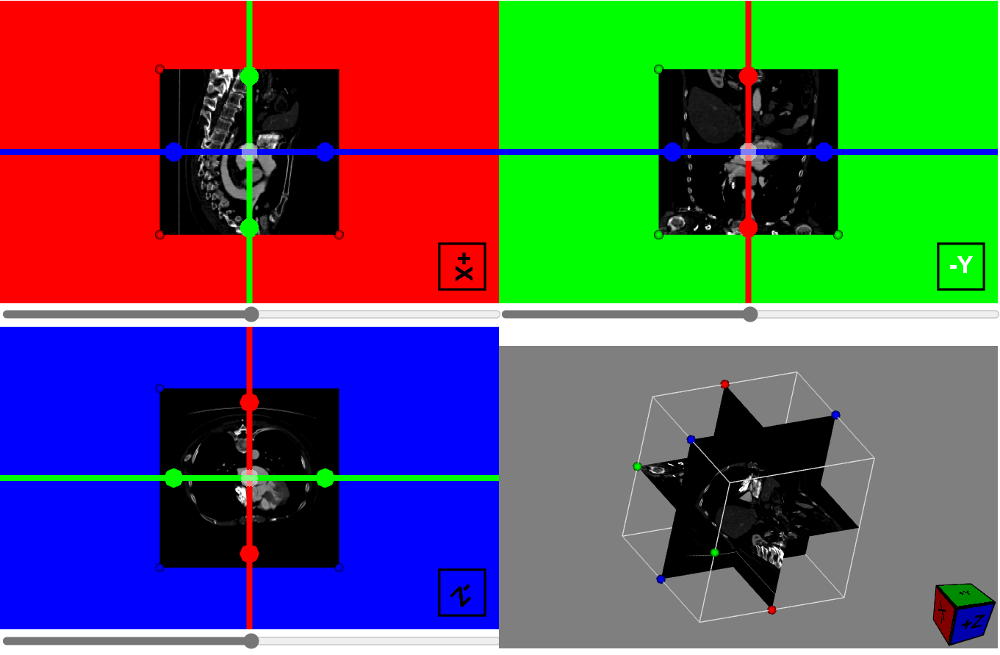
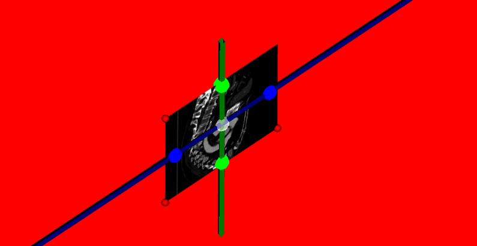

# VTKJS 下的 Widget 系统

## widget 是做什么的？

VTK.js Widget 系统是一个专门用于创建**复杂交互式 3D 对象**的高级框架。虽然表面上看起来与 Interaction 系统功能相似，但它们在设计理念、应用场景和架构层次上存在差异。

Widget 是具有以下特征的交互式 3D 对象：

- **自包含的几何体**：拥有自己的形状、外观和行为
- **状态驱动**：通过内部状态控制显示和交互
- **可视化反馈**：提供直观的视觉表示和操作提示
- **特定用途**：专门为特定的交互场景设计

### 核心特性

- **几何表示**：Widget 在场景中有实际的几何体现
- **内置行为**：封装了特定的交互逻辑和业务规则
- **状态管理**：维护复杂的内部状态和状态转换
- **多视图支持**：可在不同的渲染窗口中同时显示
- **组合架构**：由多个组件协作构成完整功能

widget 系统在 vtkjs 中主要承担下面两个职责

- 在渲染主体以为显示其他渲染对象，一般是点线面之类的辅助渲染对象，用来提供展示和交互功能
- 提供可以被鼠标选中和交互的功能，鼠标交互的过程中会更变 widget 的内部状态，同时 widget 可以调用自身的方法和函数去改变渲染主体的一些状态

这么说可能不是很直观，举一个例子。最合适的就是 MPR 平面中的十字线，我们的 MPR 渲染中三个 MPR 平面的渲染是渲染主体，然后 MPR 上面的十字线就是一个 widget。widget 提供了自己的渲染实体（点和线），同时提供了和鼠标的交互功能，鼠标拖拽点和线可以改变十字线的内部状态，比如中心点位置和三个正交平面的法向量，同时十字线又可以通过调用自身的方法，将这些状态映射到 MPR 平面中，达到 MPR 平面跟随十字线移动的效果。



widget 是 3D 的，看下图，通过调整相机位置展示了十字线的 3D 场景



## widget 系统和 interaction 系统的区别

widget 系统和 interaction 系统都有一个相同点就是可以将鼠标操作映射到对渲染主体的一些操作。在我看来其核心区别在于是否有自己有可渲染的对象。

widget 系统有自己可渲染的对象（比如上文中的十字线），需要鼠标选中了这些渲染对象之后对其做操作，此时渲染对象会改变状态，同时改变渲染主体的状态。

而 interaction 则是没有自己的可渲染对象，直接将鼠标操作映射到渲染主体的状态改变（比如将鼠标的左右上下拖动映射为 mpr 中窗位窗宽的变化，或者映射为 3D 头颅的旋转）。

## widget 系统架构

### 整体架构图

```
┌───────────────────────────────────────────────────────────┐
│                    WidgetManager                          │
│  • Widget 生命周期管理                                    │
│  • 多视图协调                                             │
│  • 选择和激活控制                                          │
│  • 渲染优化                                               │
└─────────────────────┬─────────────────────────────────────┘
                      │ 管理
                      ▼
┌───────────────────────────────────────────────────────────┐
│              AbstractWidgetFactory                       │
│  • Widget 实例创建                                        │
│  • 多视图 Widget 管理                                     │
│  • 组件组装协调                                           │
└─────────────────────┬─────────────────────────────────────┘
                      │ 创建
                      ▼
┌───────────────────────────────────────────────────────────┐
│                AbstractWidget                            │
│  • 基础 Widget 功能                                       │
│  • InteractorObserver 继承                               │
│  • 状态和表示协调                                          │
└─────┬─────────────┬─────────────┬────────────────────────┘
      │             │             │
      ▼             ▼             ▼
┌─────────────┐ ┌─────────────┐ ┌─────────────────────┐
│WidgetState  │ │Representations│ │    Behavior        │
│• 状态管理   │ │• 视觉表示     │ │• 交互逻辑           │
│• 层级状态   │ │• 渲染控制     │ │• 事件处理           │
│• 激活控制   │ │• 多种表现形式 │ │• 业务规则           │
└─────────────┘ └─────────────┘ └─────────────────────┘
```

### 组件间依赖关系

1. **WidgetManager** 协调所有 Widget 实例
2. **AbstractWidgetFactory** 负责创建和配置
3. **AbstractWidget** 提供核心 Widget 功能
4. **WidgetState** 管理复杂的状态层级
5. **Representations** 处理视觉呈现
6. **Behavior** 封装交互逻辑
7. **Manipulator** 定义坐标转换的方式将鼠标坐标转换为 3D 世界坐标

### 调用流程

我们以`Sources\Widgets\Widgets3D\ResliceCursorWidget\example\index.js`也就是 MPR 和十字线 widget 的例子来看整个调用过程和各个类之间的关系和他们发挥的作用。

#### 创建 AbstractWidgetFactory

首先因为 MPR 的三个平面中用到的都是十字线，本质上是同一个 3D 的相互垂直的三个线条和一些控制点。我们用同一个 AbstractWidgetFactory 去创建这些十字线 widget 就可以了。AbstractWidgetFactory 每次创建一个 widget 实例（也就是继承了 abstractWidget 的实体类）都会都会将自己的 WidgetState 和 Behavior（Behavior 由 Manipulator 代理，也就是 Manipulator 一致）行为赋予这个 widget 实例。也就是说只要是同一个 AbstractWidgetFactory 创建的实例，其状态 widgetState 和对于鼠标的行为响应必然一致。但是每个 widget 有自己独立 representations 和 actors，因为他们的渲染展示是不一致的。

widget 和 AbstractWidgetFactory 中的共享信息如下：
| 对象 | 是否共享 | 原因 |
|-----------------|------|-------------------|
| widgetState | ✅ 共享 | 核心数据，需要全局同步 |
| representations | ❌ 独立 | 每个视图需要独立的渲染表现 |
| manipulator | ✅ 共享 | 交互逻辑统一 |
| actors | ❌ 独立 | 每个视图有独立的 actor 进行渲染 |

在 MPR 平面中的体现就是，三个 MPR 平面中的十字线虽然有共同的状态（比如中心点坐标），和相同的鼠标响应（比如拖转控制点的移动行为一致），但是在三个平面中其实是三个不同的 widget 实例，有各自的渲染管线，彼此不相关。

十字线的 AbstractWidgetFactory 是 vtkResliceCursorWidget，所以，第一部创建这个实例，注意只需要一个就可以了。

```javascript
//这个只需要一个实例，是一个AbstractWidgetFactory,如果写了多个实例，会有状态不统一的问题
const widget = vtkResliceCursorWidget.newInstance();

//我可可以同意设置一下widgetState的状态，因为最后所有的widget实例都是共用这个状态的
const widgetState = widget.getWidgetState();
//将所有标签是'sphere'的widgetSate的scale值改为20，也就是控制点的大小
widgetState
  .getStatesWithLabel('sphere')
  .forEach((handle) => handle.setScale1(20));
```

#### 创建 widgetManager

在每个渲染平面中添加 widgetManager，并且将其和 renderer 进行关联。renderer 是渲染的场景，widgetManager 和这个场景在这一步骤中产生关联。

```javascript
const renderer = ...//定义renderer

const widgetManager = vtkWidgetManager.newInstance()
widgetManager.setRenderer(renderer)
```

也就是 setRenderer 这一步，将渲染场景中的信息和 widgetManger 类结合在一起了。添加了诸如 renderer,renderWindow,interactor,GLRenderWindow,camera 的引用到了 widgetManager。

#### 创建 widget 实例

由 widgetManger 和 AbstracWidgetFactory 搭配，通过 addWidget 函数生成具体的 widget 实例。

```javascript
//widget是vtkResliceCursorWidget的实例，xyzToViewType[i]是渲染页面的类型，也就是axial，coronal，sigittal，3D等
const widgetInstance = obj.widgetManager.addWidget(widget, xyzToViewType[i]);

//widgetInstance的继承链如下
vtkObject
    ▲
    |
vtkProp
    ▲
    |
vtkInteractorObserver
    ▲
    |
vtkAbstractWidget
```

冲继承链中可以看出 widget 的实例继承了 vtkInteractorObserver 和 vtkProp。

从 vtkInteractorObserver 获取了从 Interactor（实例是 vtkRenderWindowInteractor）订阅事件的能力。从前面的章节中我们已经知道 Interactor 负责将浏览器中的鼠标键盘事件转为 vtkjs 自身的事件，并且通过发布订阅机制和 vtkInteractorObserver 配合做到将事件传递给各个 vtkInteractorObserver 让他们自己处理。所以这里 widget 的实例也在这一步和 interactor 关联，并且订阅其鼠标事件。widget 实例内部已经通过 AbstracWidgetFactory 获得了对于鼠标事件的处理功能，目前鼠标的通过已经可以改变 widgetState 的状态了

同时 widget 也继承成了 vtkProp，意味着 widget 实例也是一个可以在场景图中渲染的节点。而 addWidget 这一步也在内部将 widget 实例添加到了渲染 renderer 使其成为场景图中 renderer 下的一个渲染节点。

同时 AbstractWidgetFactory 中的 widgetState 的引用已经添加到了 widget 实例中，所以你也可以用下面的代码来访问 widgetState

```javascript
const widgetState = widgetInstance.getWidgetState();
```

到了这一步应该可以显示十字线并且操控了，而且因为 widgetState 是同一个引用，一旦 Axial 中的十字线拖动，Sigittal 和 Coronal 中的十字线也会跟随移动。不过因为我们目前为止还是只处理了 widget 内部的状态没有将其和实际的渲染场景，即 MPR 平面，进行关联，所以你可以看到十字线动了但是 mpr 平面并不会被十字线改变

#### 移动 mpr 平面

调用 AbstractWidgetFactory（这里是 vtkResliceCursorWidget）中的内置函数，将自己的状态同步给渲染主体（这里是 MPR 切面）。

```javascript
//widget是vtkResliceCursorWidget,其中的状态已经在上一步被更新，这里通过他的函数将状态同步给切面
const modified = widget.updateReslicePlane(
  reslice, //reslice是MPR中那个切割体数据的切面
  viewType //Axial或者coronal、sigittal
);
if (modified) {
  //获取旋转矩阵
  const resliceAxes = reslice.getResliceAxes();
  // 应用旋转矩阵，其实就是移动相机到和mpr切面垂直的方向上
  actor.setUserMatrix(resliceAxes);
}
```

完成了上面的步骤我们发相 MPR 切面和十字线的行为一致了！！！

### 各个类和其功能解析

#### vtkWidgetManager

WidgetManager 负责管理场景中的所有 Widget。其核心方法是 addWidget 函数。可以通过传入一个 vtkWidgetAbstractFactory 和 viewType 来创建具体的 vtkAbstractWidget 实例，并且将鼠标事件和其绑定，同时将 vtkAbstractWidget 实例添加到 renderer 的渲染场景图中一起渲染。

```javascript
  // 添加 Widget 到场景
  addWidget(widget) {
    const viewWidget = widget.getWidgetForView({
      viewId: this.viewId,
      renderer: this._renderer
    });

    this.widgets.push(viewWidget);
    this.updateWidgetWeakMap(viewWidget);

    return viewWidget;
  }
```

**核心作用**

1. Widget 生命周期管理 - 添加、移除、配置 Widget
2. 交互处理 - 鼠标事件、触摸事件、拾取(picking)
3. 焦点控制 - 管理哪个 Widget 获得焦点
4. 渲染优化 - 双缓冲渲染（拾取缓冲 + 前端缓冲）
5. 显示缩放 - 根据摄像机调整 Widget 显示大小

**架构关系图**

```
┌────────────────────────────────────────────────────┐
│           Application Layer                        │
├────────────────────────────────────────────────────┤
│  • 创建和配置 Widget                                │
│  • 调用 widgetManager.addWidget()                  │
└────────────────────┬───────────────────────────────┘
                     │
                     ▼
┌────────────────────────────────────────────────────┐
│        vtkWidgetManager (核心)                     │
├────────────────────────────────────────────────────┤
│  • widgets[]          - Widget 列表                │
│  • activeWidget       - 当前活跃 Widget             │
│  • widgetInFocus      - 获得焦点的 Widget           │
│  • pickingEnabled     - 拾取是否启用                │
│  • renderer           - 所在的渲染器                │
└──────────────────┬─────────────────────────────────┘
                   │
      ┌────────────┼────────────┐
      │            │            │
      ▼            ▼            ▼
┌────────┐  ┌────────┐  ┌──────────┐
│Renderer│  │Interactor│ │Selector  │
│(场景)  │  │(交互)   │ │(拾取)   │
└────────┘  └────────┘  └──────────┘
```

**事件处理和拾取**

```

  // 拾取流程
  ┌─────────────┐
  │ 鼠标事件     │
  ├─────────────┤
  │ onMouseMove │
  └──────┬──────┘
         │
         ▼
  ┌──────────────────────┐
  │ updateSelection()    │
  ├──────────────────────┤
  │ 查询拾取缓冲          │
  │ 获取点击的 Widget     │
  └──────┬───────────────┘
         │
         ▼
  ┌──────────────────────┐
  │ activateHandle()     │
  ├──────────────────────┤
  │ 激活相应 handle       │
  │ 触发 Widget 交互      │
  └──────────────────────┘
```

#### AbstractWidgetFactory

AbstractWidgetFactory 是 vtk.js Widget 系统的工厂基类，负责：

1. 为每个视图创建 Widget 实例 - 支持多视口、多视图场景
2. 管理视图与 Widget 的映射 - viewId → Widget 对应关系
3. 整合 Widget 三大核心部件 - State、Behavior、Representation
4. 提供统一的控制接口 - 批量操作所有视图 Widget

**工厂模式设计**

```
┌─────────────────────────────────────────────┐
│  AbstractWidgetFactory (工厂基类)            │
│                                             │
│  所有 Widget 的共享配置和方法               │
│  • widgetState (共享状态)                   │
│  • behavior (交互行为逻辑)                  │
│  • getRepresentationsForViewType()         │
│  • methodsToLink (方法代理)                │
└─────────────────┬─────────────────────────┘
                  │
      ┌───────────┴─────┐
      │                 │
      ▼                 ▼
┌──────────┐      ┌──────────┐
│ View 1   │      │ View 2   │
│ Widget   │      │ Widget   │
│ (场景1)  │      │ (场景2)  │
└──────────┘      └──────────┘
```

这个抽象工厂的核心功能是将为所有继承它的类提供一个基本的函数，可以实现用不同的工厂中的基本信息（比如需要的 widgetState，处理鼠标行为的 hehavior，用于渲染表示的 representation）构建返回具体的 widget 实例。核心函数就是`getWidgetForView`函数。

```

  ┌──────────────────────────────────────────────────────┐
  │  widgetManager.addWidget(widget, viewType)          │
  └────────────────────┬─────────────────────────────────┘
                       │
                       ▼
  ┌──────────────────────────────────────────────────────┐
  │  widget.getWidgetForView({ viewId, renderer, ... })  │
  │  (由 AbstractWidgetFactory 实现)                     │
  └────────┬──────────────┬──────────────┬──────────────┘
           │              │              │
           ▼              ▼              ▼
     ┌─────────┐  ┌──────────┐  ┌────────────┐
     │创建Widget│  │创建Repre-│  │应用Behavior│
     │实例      │  │sentations│  │(交互逻辑)  │
     └─────────┘  └──────────┘  └────────────┘
           │              │              │
           └──────────────┼──────────────┘
                          │
                          ▼
               ┌──────────────────────┐
               │代理方法到Widget      │
               │(Representation方法)  │
               └──────────────────────┘
                          │
                          ▼
               ┌──────────────────────┐
               │缓存到viewToWidget    │
               │返回完整的Widget      │
               └──────────────────────┘
```

用 MPR 和十字线举例，当我们的 MPR 十字线抽象工厂 vtkResliceCursorWidget（就是 vtkAbStractWidgetFactory 继承而来的一个具体的工厂），被 addWidget 方法调用时候，内部会调用 vtkAbStractWidgetFactory 的 getWidgetForView 函数，这个函数会将 vtkResliceCursorWidget 里面具体的创建 widget 实例和实现、创建 representations 的实现，创建 behavior 的实现进行调用，进而返回十字线的 widget 实例。

vtkResliceCursorWidget 的 state.js 中定义了 widgetState，behavior.js 中定义了鼠标操作，index.js 中定义了 representations 的定义。

#### AbstractWidget

AbstractWidget 是由上面的 getWidgetForView 函数返回的 widget 实例的基类，负责：

1. 连接 State、Behavior 和 Representation - 作为三者的粘合剂
2. 管理 Widget 与渲染器的交互 - 继承自 vtkProp (可渲染)
3. 处理用户交互事件 - 继承自 vtkInteractorObserver (可观察事件)
4. Handle 激活/停用 - 管理交互式手柄
5. 焦点管理 - 控制 Widget 是否获得键盘/鼠标焦点

同时 AbstractWidget 会直接获得所有从 AbStractWidgetFactory 的 widgetState 的引用，所以无论用同一个 AbStractWidgetFactory 工厂创建了多少个 widget 实例，他们都共享 widgetState 状态。

同时 AbstractWidget 会将自己添加到 renderer 的渲染管线中，可以是自己和整个 renderer 一起渲染。

#### WidgetState

vtkWidgetState 是 vtk.js Widget 系统的中央数据存储，负责：

1. 存储 Widget 的所有状态数据 - 如位置、颜色、大小等
2. 管理嵌套状态层次 - 支持多级子状态（Handle、Group 等）
3. 激活/停用管理 - 跟踪哪些部分是"活跃"的
4. 标签分组 - 按功能标签组织子状态
5. 状态变化通知 - 当状态改变时通知监听者

vtkWidgetState 的核心思想：

```
┌─────────────────────────────────────┐
│   所有状态数据都存在一棵树中        │
│                                     │
│  ├─ Root (主 Widget 状态)          │
│  │  ├─ origin       (位置)         │
│  │  ├─ color        (颜色)         │
│  │  ├─ scale        (大小)         │
│  │  └─ nested states (子状态)      │
│  │     ├─ moveHandle              │
│  │     │  ├─ origin               │
│  │     │  ├─ color                │
│  │     │  └─ scale                │
│  │     ├─ handle[0]               │
│  │     ├─ handle[1]               │
│  │     └─ handle[2]               │
│  │                                 │
│  标签: ['moveHandle', 'handles']   │
└─────────────────────────────────────┘
```

widgetState 的字状态有自己的 name，可以通个 getName()，比如 getMoveHandle()来获取子状态。有自己的 label，可以通过 getStatesWithLabel('xxx')获取所有的 label 的状态。如果事 Mixin 组合而成的 widgetState，那这个 widgetState 会拥有 Mixin 中的方法，比如 origin mixin 的 widgetState 有 getOrigin，setOrigin 方法。

widgetState 通过 StateBuilder 类进行创建，StateBuilder 可以通过通过链式调用，将某个具体的 AbstractWidgetFactory 派生类中定义的 state 构建为 widgetState。 StateBuilder 提供四种添加状态的方法：

1. addStateFromMixin() → 单个固定 Mixin 子状态
2. addDynamicMixinState() → 可动态创建/删除的 Mixin 子状态列表
3. addStateFromInstance() → 添加已有的状态实例，也就是一个子 widgetState
4. addField() → 添加简单字段，其实是一个 js 属性

完整的 widgetState 的创建流程

```javascript
//完整的创建流程

  vtkStateBuilder.createBuilder()
          ↓
    new Builder()
    ├─ this.publicAPI = {}
    ├─ this.model = {}
    ├─ vtkWidgetState.extend()  ← 添加基础功能
    └─ bounds.extend()           ← 所有 Widget 都需要
          ↓
  .addStateFromMixin({             ← 添加单个固定子状态
    labels: ['moveHandle'],
    mixins: ['origin', 'color'],
    name: 'moveHandle'
  })
          ↓
  .addDynamicMixinState({          ← 添加可动态修改的子状态
    labels: ['handles'],
    mixins: ['origin', 'color'],
    name: 'handle'
  })
          ↓
  .addField({                      ← 添加简单字段
    name: 'someValue',
    initialValue: 0
  })
          ↓
  .build()                         ← 完成构建
          ↓
  vtkWidgetState 实例 (冻结)
```

下面用 LineWidget（AbstractWidgetFactory 的一个实现）来举例，看这个 widget 是如何构建自己的 widgetState 的。首先在 LineWidget 中有一个 state.js 文件，其中定义了整个 stateBuilder 的链式调用过程。核心在下面的函数。

```javascript
const linePosState = vtkStateBuilder
  .createBuilder()
  .addField({
    name: 'posOnLine',
    initialValue: 0.5,
  })
  .build();

export default function generateState() {
  return (
    vtkStateBuilder
      .createBuilder()
      .addStateFromMixin({
        labels: ['moveHandle'],
        mixins: [
          'origin',
          'color',
          'scale1',
          'visible',
          'manipulator',
          'shape',
        ],
        name: 'moveHandle',
        initialValues: {
          scale1: 30,
          visible: true,
        },
      })
      /*  说明：
  - name: 'moveHandle' → 生成 getMoveHandle() / setMoveHandle()
  - labels: ['moveHandle'] → 可通过 getStatesWithLabel('moveHandle') 查询
  - mixins:
    - origin - 位置 [x, y, z]
    - color - 颜色 (RGBA)
    - scale1 - 大小
    - visible - 是否显示
    - manipulator - 交互操纵器
    - shape - Handle 形状 (sphere, cube, cone 等)
  - initialValues:
    - scale1: 30 - 初始大小 30
    - visible: true - 默认可见
*/
      .addStateFromMixin({
        labels: ['handle1'],
        mixins: [
          'origin',
          'color',
          'scale1',
          'visible',
          'manipulator',
          'shape',
        ],
        name: 'handle1',
        initialValues: {
          scale1: 30,
        },
      })
      .addStateFromMixin({
        labels: ['handle2'],
        mixins: [
          'origin',
          'color',
          'scale1',
          'visible',
          'manipulator',
          'shape',
        ],
        name: 'handle2',
        initialValues: {
          scale1: 30,
        },
      })
      .addStateFromMixin({
        labels: ['SVGtext'],
        mixins: ['origin', 'color', 'text', 'visible'],
        name: 'text',
        initialValues: {
          /* text is empty to set a text filed in the SVGLayer and to avoid
           * displaying text before positioning the handles */
          text: '',
        },
      })
      //添加之前创建的linePosState
      .addStateFromInstance({ name: 'positionOnLine', instance: linePosState })
      //添加基本属性
      .addField({ name: 'lineThickness' })
      .build()
  ); //完成构建
}
```

创建完了上面的 WidgetState 之后就可以在获取 widgetState 的地方使用

```javascript
// 获取各个 Handle
  const moveHandle = model.widgetState.getMoveHandle();
  const handle1 = model.widgetState.getHandle1();
  const handle2 = model.widgetState.getHandle2();

  // 修改位置
  moveHandle.setOrigin([0, 0, 0]);
  handle1.setOrigin([1, 0, 0]);
  handle2.setOrigin([2, 0, 0]);

  // 修改外观
  moveHandle.setColor([1, 0, 0]);      // 红色
  moveHandle.setShape('cone');         // 锥形
  moveHandle.setScale1(20);            // 大小

  // 修改文本
  const textState = model.widgetState.getText();
  textState.setText('距离: 2.5cm');
  textState.setColor([0, 0, 0]);       // 黑色

  // 修改文本位置
  const posOnLine = model.widgetState.getPositionOnLine();
  posOnLine.setPosOnLine(0.3);         // 30% 的位置

  // 通过label查询所有这个label状态
  const moveHandleList = model.widgetState.getStatesWithLabel('moveHandle');
  const moveHandleList.map(state => state.setOrigin([0,0,0]))//同时设置所有label为moveHandle的State
```

#### Manipulator

Manipulator 是 vtk.js Widget 系统中的坐标转换和坐标约束层，负责：

1. 将鼠标 2D 屏幕坐标转换为 3D 世界坐标 - 最关键的功能
2. 支持多种交互约束 - 平面拖动、线性拖动、表面拖动等
3. 计算拖动的增量 - worldDelta (相对移动量)
4. 简化 Behavior 代码 - Behavior 只需调用 handleEvent()

**架构设计**

```
Manipulator 的地位
      ↑
Behavior 层 (知道是什么交互)
└─ 调用 manipulator.handleEvent()
      ↑
Manipulator 层 (怎样实现交互)
├─ 屏幕坐标 → 世界坐标
├─ 约束运动方向和平面
└─ 计算增量
      ↑
鼠标事件 (x, y, 屏幕空间)
```

**6 种 Manipulator**

| Manipulator         | 用途     | 约束方式             | 用法               |
| ------------------- | -------- | -------------------- | ------------------ |
| AbstractManipulator | 基类     | -                    | 继承基础功能       |
| PlaneManipulator    | 平面拖动 | 限制在某个平面       | 2D 面/矩形的拖动   |
| LineManipulator     | 线性拖动 | 限制在某条线上       | 1D 滑块/轴向移动   |
| PickerManipulator   | 表面拖动 | 限制在 geometry 表面 | 自由形状表面的拖动 |

|
| TrackballManipulator | 旋转 | 旋转方向向量 | 方向/旋转的改变 |  
| CPRManipulator | 弯曲路径 | 特殊约束 | 曲面重构 |

AbstractManipulator 作为基类，提供了约束的基本属性定义和规则获取。比如下面 js 代码，定义了按照不同的优先级获取当前 manipulator 的 Origin 或者 normal 的方法。

```javascript
//AbstarctManipulator/index.js
publicAPI.getOrigin = (callData) => {
  //如果userOrigin存在，返回userOrigin作为origin
  if (model.userOrigin) return model.userOrigin;
  //可以使用相机的FocalPoint作为origin
  if (model.useCameraFocalPoint)
    return callData.pokedRenderer.getActiveCamera().getFocalPoint();
  //同理可以用handleOrigin或者widgetOrigin
  if (model.handleOrigin) return model.handleOrigin;
  if (model.widgetOrigin) return model.widgetOrigin;
  return [0, 0, 0];
};

publicAPI.getNormal = (callData) => {
  if (model.userNormal) return model.userNormal;
  if (model.useCameraNormal)
    return callData.pokedRenderer.getActiveCamera().getDirectionOfProjection();
  if (model.handleNormal) return model.handleNormal;
  if (model.widgetNormal) return model.widgetNormal;
  return [0, 0, 1];
};
```

具体的 manipulator 则是利用这些基本的函数和自身的约束将屏幕坐标系映射到空间的位置。用 PlaneManipulator 作为例子来说明。

**实际使用示例**

LineWidget 这个工厂实例在鼠标操作时候就是用了 PlaneManupulator

```javascript
//LineWidget/index.js
//这里设置了useCameraNormal，所以最后这个manipulator的约束平面的法向量为当前相机的视线位置，没有设定Origin，所以最后Origin根据AbstarctManipulator的定义getOrigin()会返回[0,0,0]
publicAPI.setManipulator(
  model.manipulator ||
    vtkPlaneManipulator.newInstance({ useCameraNormal: true })
);

//1. LineWidget 使用 PlaneManipulator
// LineWidgt/index.js
publicAPI.setManipulator = (manipulator) => {
  superClass.setManipulator(manipulator);
  model.widgetState.getMoveHandle().setManipulator(manipulator);
  model.widgetState.getHandle1().setManipulator(manipulator);
  model.widgetState.getHandle2().setManipulator(manipulator);
};

//2. 在 Behavior 中调用 Manipulator

// LineWidget/behavior.js
publicAPI.handleMouseMove = (callData) => {
  const manipulator =
    model.activeState?.getManipulator?.() ?? model.manipulator;

  if (manipulator) {
    // 1. 调用 Manipulator 进行坐标转换和约束,返回当前屏幕鼠标坐标对应的3D空间的坐标，因为我们的约束是一个
    //法向量为当前摄像机方向，经过[0,0,0]这个点的平面，所以返回的坐标点就是这个屏幕坐标映射到这个平面上的3D坐标
    //相当于鼠标在为位置沿着相机视线方向发出一条射线，这个射线和法向量为摄像机方向，
    // 经过[0,0,0]的这个点的平面的焦点的3D坐标
    const { worldCoords, worldDelta } = manipulator.handleEvent(
      callData,
      model._apiSpecificRenderWindow
    );

    // 2. 使用返回的坐标更新状态
    const curOrigin = model.activeState.getOrigin();
    if (curOrigin) {
      // 方法 A: 使用相对增量（推荐）
      model.activeState.setOrigin(add(curOrigin, worldDelta, []));
    } else {
      // 方法 B: 直接设置坐标
      model.activeState.setOrigin(worldCoords);
    }
  }
};
```

#### Representations

Representations 是 vtk.js Widget 系统中的可视化层，负责：

1. 监听 Widget State 的变化 - 订阅状态修改事件
2. 将状态转换为可视对象 - State → VTK Actors
3. 实时渲染交互反馈 - 高亮、改变颜色、改变大小等
4. 提供拾取支持 - 通过拾取缓冲检测鼠标点击

Representations 会将 widgetState 收集，然后构建成自己的渲染管线，将这些 widgetState 按照不同的方式渲染出来，前文已经提过，widget 的实体会被添加到 renderer 中而 representations 又会添加到 widget 的实体中，因为 representations 也是 vtkProp，所以，这些也会被添加到场景图中被渲染管线渲染。

**16 种 Representations 分类**

```
  A. Handle Representations（交互手柄）

  HandleRepresentation (基类)
  ├─ SphereHandleRepresentation    ← 球形 Handle
  ├─ ArrowHandleRepresentation     ← 箭头 Handle
  ├─ CubeHandleRepresentation      ← 立方体 Handle
  └─ LineHandleRepresentation      ← 线形 Handle

  特点：
  - behavior: Behavior.HANDLE
  - pickable: true      ← 可拾取（用户可点击）
  - dragable: true      ← 可拖动
  - scaleInPixels: true ← 大小保持像素恒定

  B. Context Representations（上下文/背景）

  ContextRepresentation (基类)
  ├─ CircleContextRepresentation       ← 圆形
  ├─ RectangleContextRepresentation    ← 矩形
  ├─ SphereContextRepresentation       ← 球体
  ├─ OutlineContextRepresentation      ← 轮廓
  ├─ ConvexFaceContextRepresentation   ← 凸面
  ├─ SplineContextRepresentation       ← 样条曲线
  └─ CroppingOutlineRepresentation     ← 裁剪轮廓

  特点：
  - behavior: Behavior.CONTEXT
  - pickable: false     ← 不可拾取（仅显示）
  - dragable: true      ← 但可跟随拖动

  C. 其他 Representations

  ├─ GlyphRepresentation          ← Glyph 映射（基础 Handle）
  ├─ ImplicitPlaneRepresentation  ← 隐式平面
  └─ PolyLineRepresentation       ← 多边形线

  Behavior 常数

  const Behavior = {
    HANDLE: 0,    // 可交互的手柄 - 响应鼠标事件
    CONTEXT: 1    // 上下文装饰 - 显示参考信息
  };

  // Handle (HANDLE)
  ├─ 用户可点击和拖动
  ├─ WidgetManager 拾取这些
  └─ 显示为高对比度（便于识别）

  // Context (CONTEXT)
  ├─ 用户不能直接交互
  ├─ 提供参考信息（如坐标轴、网格）
  └─ 可视化 Widget 的几何体

```

用 LineWidget 这个 AbstractWidgetFactory 的实例来详细解释 representations 的作用和用法
首先回顾 LineWidget 的状态结构：

```
  // Sources/Widgets/Widgets3D/LineWidget/state.js
  LineWidgetState
  ├─ moveHandle    (中点，显示和移动整条线)
  ├─ handle1       (起点)
  ├─ handle2       (终点)
  ├─ text          (文本标签)
  ├─ positionOnLine (文本位置)
  └─ lineThickness (线宽)
```

LineWidget 中对于其要渲染的 representations 的定义如下

```javascript
// Sources/Widgets/Widgets3D/LineWidget/index.js (第 35-130 行)

  publicAPI.getRepresentationsForViewType = (viewType) => {
    switch (viewType) {
      case ViewTypes.DEFAULT:
      case ViewTypes.GEOMETRY:
      case ViewTypes.SLICE:
      case ViewTypes.VOLUME:
      default:
        return [
          // 第一个 Representation: Handle1 的箭头
          {
            builder: vtkArrowHandleRepresentation,
            labels: ['handle1'],
            initialValues: {
              visibilityFlagArray: [false, false],
              coincidentTopologyParameters: {
                Point: { factor: -1.0, offset: -1.0 },
                Line: { factor: -1.0, offset: -1.0 },
                Polygon: { factor: -3.0, offset: -3.0 }
              }
            }
          },

          // 第二个 Representation: Handle2 的箭头
          {
            builder: vtkArrowHandleRepresentation,
            labels: ['handle2'],
            initialValues: { ... }  // 同上
          },

          // 第三个 Representation: MoveHandle 的箭头
          {
            builder: vtkArrowHandleRepresentation,
            labels: ['moveHandle'],
            initialValues: { ... }  // 同上
          },

          // 第四个 Representation: 连接线
          {
            builder: vtkPolyLineRepresentation,
            labels: ['handle1', 'handle2', 'moveHandle'],
            initialValues: {
              behavior: Behavior.HANDLE,
              pickable: true
            }
          }
        ];
    }
  };
```

上文中定义了 representation 的构造函数和其他一些对应构造时候需要传递的参数。可以看到每个 representation 都有对应的 label，这些 label 就是他会从 widgetState 中获取的状态，representation 再根据这些状态信息构建自己的渲染对象。举个最简单的例子如果我用`handle`这个 lable 获取了 2 个 widgetState，其中都包含 Origin 这个属性，然后我的 representation 是一个渲染球的 vtkArrowHandleRepresentation（名字叫 Arrow，但是可以渲染球），那么这两个点的信息最后就会被渲染到 origin 指代的坐标位置。当然 widgetstate 中肯定还包括 color，scale 之类的属性，就可以决定球的大小颜色。

上述构造函数会在 `AbstractWidgetFactory.getWidgetForView()`函数中创建为具体的 representation，然后添加到 widget 实例。

```javascript
// AbstractWidgetFactory.getWidgetForView() 中的绑定
// 创建 Representation
widgetModel.representations = publicAPI
  .getRepresentationsForViewType(viewType)
  .map(({ builder, labels, initialValues }) =>
    builder.newInstance({
      _parentProp: widgetPublicAPI,
      labels,
      ...initialValues,
    })
  );

// 连接 State 到 Representation
widgetModel.representations.forEach((r) => {
  // 关键：将 State 作为 Representation 的输入数据
  r.setInputData(widgetModel.widgetState);

  // 创建 Actor → Representation 的映射
  r.getActors().forEach((actor) => {
    widgetModel.actorToRepresentationMap.set(actor, r);
  });
});
```

同时 widget 实例会将 widgetState 通过 setInputData 函数连接到 representation。

为了简单我们只看 vtkArrowHandleRepresentaion,在其中有下面的代码。

```javascript
//构造渲染管线，将一个坐标点渲染为一个球
model.displayMapper = vtkPixelSpaceCallbackMapper.newInstance();
model.displayActor = vtkActor.newInstance({ parentProp: publicAPI });
// model.displayActor.getProperty().setOpacity(0); // don't show in 3D
model.displayActor.setMapper(model.displayMapper);
model.displayMapper.setInputConnection(publicAPI.getOutputPort());
publicAPI.addActor(model.displayActor);
model.alwaysVisibleActors = [model.displayActor];

//indata就是widgetState，从中获取信息
publicAPI.requestData = (inData, outData) => {
  // FIXME: shape should NOT be mixin, but a representation property.
  //获取渲染的点的形状，可以是球，方块，三角，圈等
  const shape = publicAPI.getRepresentationStates(inData[0])[0]?.getShape();
  let shouldCreateGlyph = model._pipeline.glyph == null;
  if (model.shape !== shape && Object.values(ShapeType).includes(shape)) {
    model.shape = shape;
    shouldCreateGlyph = true;
  }
  if (shouldCreateGlyph && model.shape) {
    //核心：创建图形元数据，并且连接到mapper，这些渲染管道中就有了图形的可渲染顶点信息
    model._pipeline.glyph = createGlyph(model.shape);
    model._pipeline.mapper.setInputConnection(
      model._pipeline.glyph.getOutputPort(),
      1
    );
  }
  return superClass.requestData(inData, outData);
};
```

这样 vtkArrowHandleRepresentaion 就可以通过 widgetState 渲染一个图形了，而且 vtkArrowHandlwPresentation 又在整个 renderer 的场景图中，每次状态变化后，只要调用 renderer 的 rener()函数就会看到所有的状态都更新到了新的位置。

#### State Mixin 系统

vtkjs 的 widgetSate 可以添加由 Mixin 组合而成的子状态。 Mixin（混入） 是一种设计模式，用于组合可复用的功能块。在 vtk.js 的 StateBuilder 中，每个 Mixin 都是一个独立的功能模块，包含：

1. 属性定义 - 通过 DEFAULT_VALUES 定义默认值
2. 方法实现 - 核心功能代码
3. 扩展函数 - extend(publicAPI, model, initialValues) 用于将功能混入对象

可以将 Mixin 理解为用来构建一个子 widgetState 的和基本属性。

StateBuilder 这个用来构建 widgetState 的类中提供了 14 个内置 Mixin：

| Mixin       | 功能       | 示例方法                              |
| ----------- | ---------- | ------------------------------------- |
| origin      | 3D 位置    | getOrigin(), setOrigin(), translate() |
| color       | 标量颜色   | getColor(), setColor()                |
| color3      | RGB 颜色   | getColor3(), setColor3()              |
| scale1      | 单轴缩放   | getScale1(), setScale1()              |
| scale3      | 三轴缩放   | getScale3(), setScale3()              |
| direction   | 方向向量   | getDirection(), setDirection()        |
| orientation | 旋转角度   | getOrientation(), setOrientation()    |
| visible     | 可见性     | getVisible(), setVisible()            |
| manipulator | 交互操纵器 | getManipulator(), setManipulator()    |
| text        | 文本内容   | getText(), setText()                  |
| name        | 名称标识   | getName(), setName()                  |
| bounds      | 边界框     | getBounds(), setBounds()              |
| corner      | 角位置     | getCorner(), setCorner()              |
| shape       | 形状类型   | getShape(), setShape()                |

比如在 StateBuilder 中由这样的函数流程来添加 Mixin

```javascript
// 1. 创建 Builder 实例
const builder = vtkStateBuilder.createBuilder();
//2. 添加状态（每个状态由多个 Mixin 组成）
builder.addStateFromMixin({
  labels: ['handles'],
  mixins: ['origin', 'color', 'scale1'],
  name: 'moveHandle',
});
```

上面这个代码的意思就是在 widgetState 中添加一个子 widgetState，这个子 widgetState 由中由三个属性，origin，color，scale1。并且这个子 widgetState 将被赋予 moveHandle 的名字添加到父 widgetState 中，添加 handles 这个 label。这三个 Mixin 其实定义了一个点，Origin 是其位置，color 是颜色，scale1 是大小。我们可以通过 Mixin 将一些基本属性组合构建出复杂的 widgetState。

这一步完成后，你可以做下面这些事。

```javascript
//widget是vtkAbstractWidgetFactor或者vtkAcstractWidget都可以，拿到最顶层widgetState
const widgetState = widget.getWidgetState();

//通过名称获取子widgetState
const moveHandleWidgetState = widgetState.getMoveHandle();

//这个widgetState同时也是origin，color,scale1这三个mixin的组合，可以进一步获取mixin内部的信息，但是Mixin内部具体的函数需要看Mixin的定义，比如查看OriginMixin这个类，知道里面有getOrigin和setOrigin方法。所以可以如下调用
const origin = moveHandleWidgetState.getOrigin(); //几个mixin和子widgetState是继承链的关系，不是相互包含，所以直接在moveHandleWidgetState上调用getOrigin()就可以。

//同时可以访问colormixin的方法
moveHandleWidgetState.getMoveHandle().setColor(0.5); // color mixin

//通过label获取所有有这个label的子widgetState，可能有一个或者多个，返回列表
const widgetStates = widgetState.getStatesWithLabel('handles');
```
